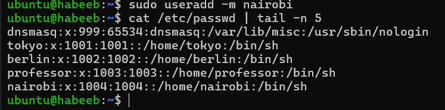
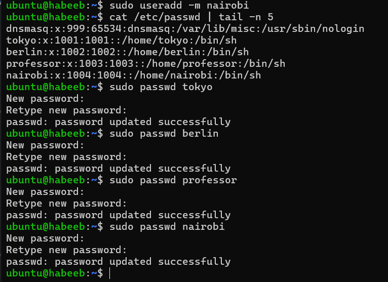
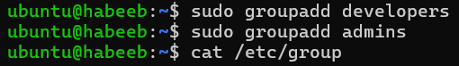
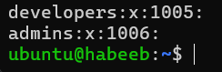
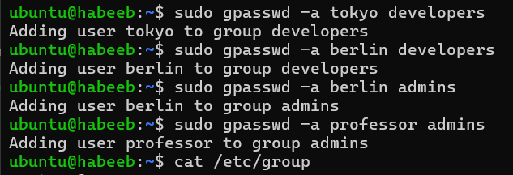
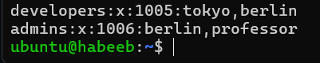
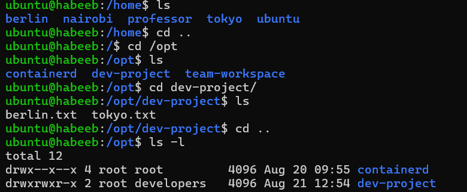
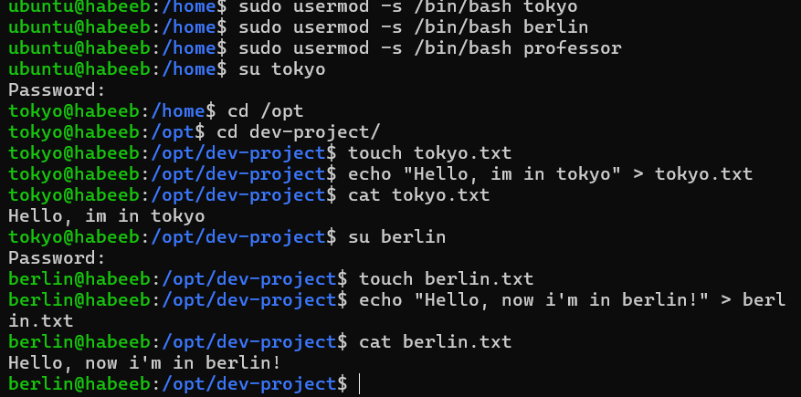
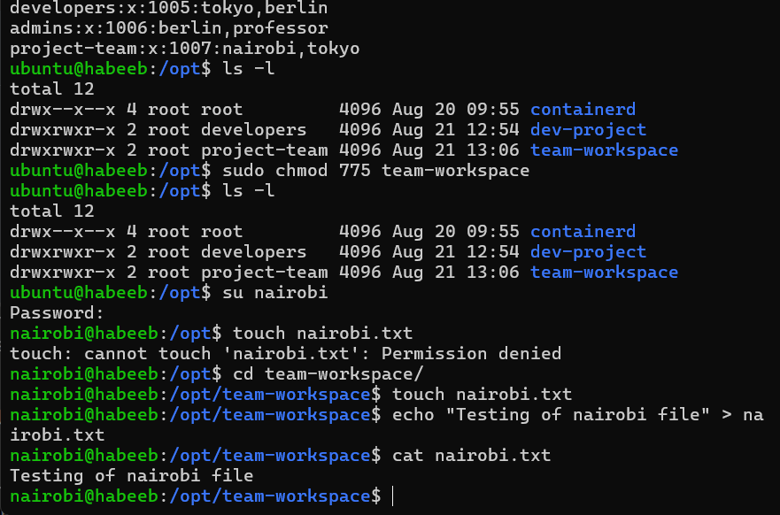

# Practice User and Group Management

## Create users: (Task-1)

* `useradd -m <username>` (use sudo)

* `sudo passwd <username>` (to set password)

## Create groups: (Task-2)

* `sudo groupadd <groupname>`

* `cat /etc/group` (lists recent groups)

## Assign users to groups: (Task-3)

* `sudo gpasswd -a <username> <groupname>`

* `cat /etc/group` (to view assigned users to groups)

## Shared Directory: (Task-4)
* Create directory: /opt/dev-project
* Set group owner to developers
* Set permissions to 775 (rwxrwxr-x)
* Test by creating files as tokyo and berlin

* `mkdir /opt/dev-project`
* `sudo chgrp developers /opt/dev-project` (change group owner to developers)
* `sudo chmod 775 dev-project` (full permissions to user and group except others)
* `sudo usermod -s /bin/bash <username>` (sets Bash as the default login shell for the specified user)

  

* `touch` - create a file `echo` - demo message `cat`- display content.

  

## Team-Workspace: (Task-5)

* Create user nairobi with home directory
* Create group project-team
* Add nairobi and tokyo to project-team
* Create /opt/team-workspace directory
* Set group to project-team, permissions to 775
* Test by creating file as nairobi

 

# Commands-USED

* sudo useradd -m username - Add user with default directory
* sudo passwd username - Set password
* sudo groupadd groupname - Add group
* sudo usermod -s /bin/bash username - Changes shell to bash.
* sudo gpasswd -a username groupname - Assigns users to groups
* sudo chgrp newgroupname file/directory  - Change group ownership of a directory or file
* sudo chmod 775 file/directory - Change permissions of a file or directory

