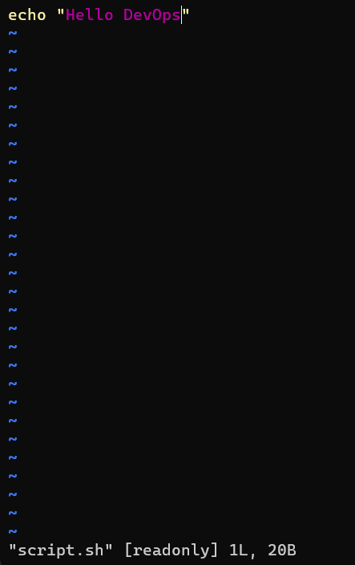
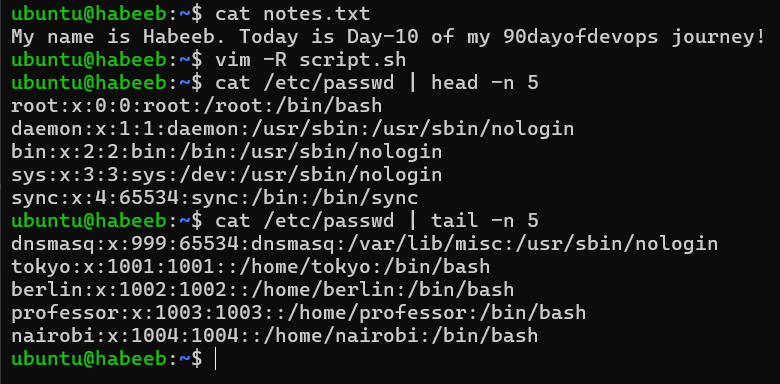
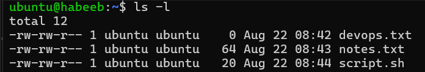
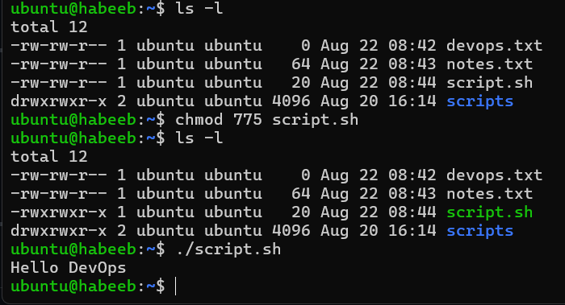
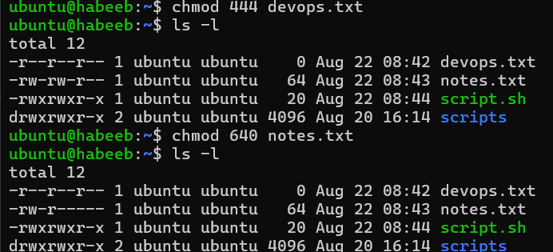
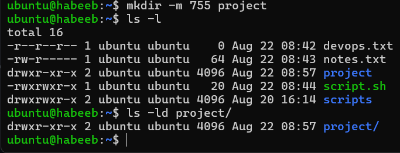
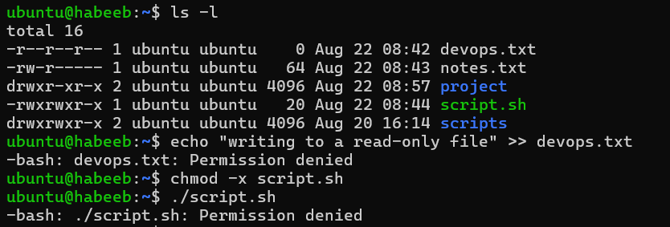

# File Permissions & File Operations Challenge

## Task 1: Create files

`touch devops.txt` - creates an empty file.

`touch notes.txt` and then `echo "my name is habeeb" > notes.txt` - a file with some content.

`vim script.sh` - with content echo "Hello Devops".

 

 

## Task 2: Read files

`cat notes.txt` - reads file

`vim -R script.sh` - View script.sh in vim read-only mode.

`cat /etc/passwd | head -n 5` - displays first 5 lines of /etc/passwd

`cat /etc/passwd | tail -n 5` - displays last 5 lines of /etc/passwd

## Task 3: Understand permissions

`-rw-rw-r--` - i.e. (devops.txt) represents file permissions where the owner and group can read and write, while everyone else can only read.

r = read (4), w = write (2), x = execute (1)

## Task 4: Modify Permissions

`chmod 775 script.sh` or `chmod +x script.sh` - changes permission to make it executable.

`chmod 444 devops.txt` or `chmod -w devops.txt` - changes to read-only permission or remove write.

`chmod 640 notes.txt` - changes permission to owner: rw, group: r, others: none

`mkdir -m 755 project` - creates directory project/ with permissions 755 where the -m flag (short for mode) sets the directory's access permissions at the exact moment it is created.

## Task 5: Test Permissions

`Writing to a read-only file - what happens?`

`Try executing a file without execute permission`

## Error Messages:

* Writing to a read‑only file normally gives Permission denied

* Executing a file without execute permission gives Permission denied.

## Commands Used:

`touch` : Creates an empty file if it doesn't exist.

`vim filename`: Opens a file inside the Vim text editor.

`cat` : Displays the entire contents of a file directly in the terminal output.

`cat /etc/passwd | head -n 5` : Displays the first 5 lines of a file.

`cat /etc/passwd | tail -n 5` : Displays the last 5 lines of a file.

`chmod +x` or `chmod 755` : Adds execute permission to a file, making it runnable as a script or program.

`chmod -w` or `chmod 444` : Removes write permission from a file, protecting it from being modified or overwritten.

`chmod 755` : Sets full permissions (rwx) for the owner and read/execute permissions (r-x) for the group and others.

