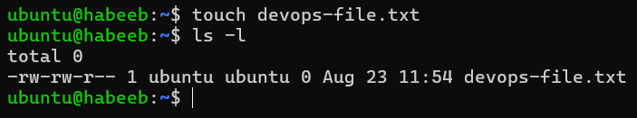
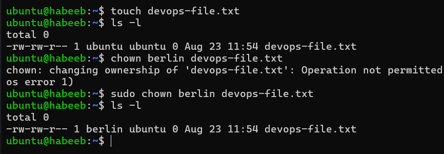
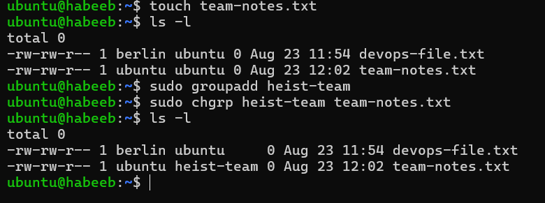
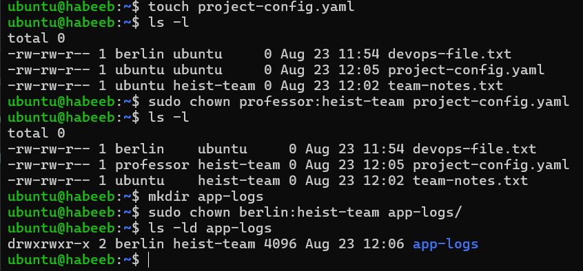
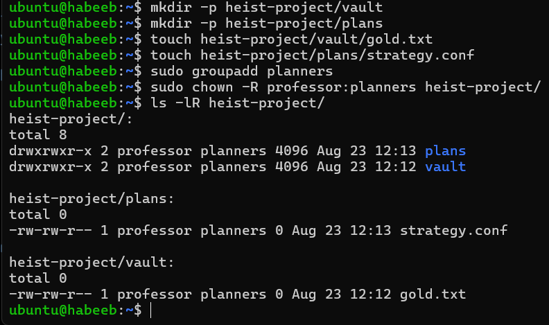

# File Ownership Challenge 

## Task 1: Understanding ownership 

`owner` - The owner is usually the user who created the file or directory.

`group` - A group is a collection of users who share access to the file.

## Task 2: Basic CHOWN operations

* Create file devops-file.txt

* Check current owner: ls -l devops-file.txt

* Change owner to berlin

* Verify the changes

## Task 3: Basic CHGRP operations

* Create file team-notes.txt
  
* Check current group: ls -l team-notes.txt
  
* Create group: sudo groupadd heist-team
  
* Change file group to heist-team
  
* Verify the change

## Task 4: Combined Owner & Group Change

* Using chown you can change both owner and group together:

* Create file project-config.yaml

* Change owner to professor AND group to heist-team (one command)

* Create directory app-logs/

* Change its owner to berlin and group to heist-team

## Task 5: Recursive Ownership

* Create directory structure:

* Create group `planners`: `sudo groupadd planners`

* Change ownership of entire `heist-project/` directory:
- Owner: `professor`
- Group: `planners`
- Use recursive flag `(-R)`

* Verify all files and subdirectories changed: `ls -lR heist-project/`

## Task 6: Practice Challenge

[snapshot](Images/task6.png)

## COMMANDS USED:

* View ownership
  
`ls -l filename`

* Change owner only

`sudo chown newowner filename`

* Change group only
  
`sudo chgrp newgroup filename`

* Change both owner and group
  
`sudo chown owner:group filename`

* Recursive change (directories)
  
`sudo chown -R owner:group directory/`

* Change only group with chown
  
`sudo chown :groupname filename`

  
