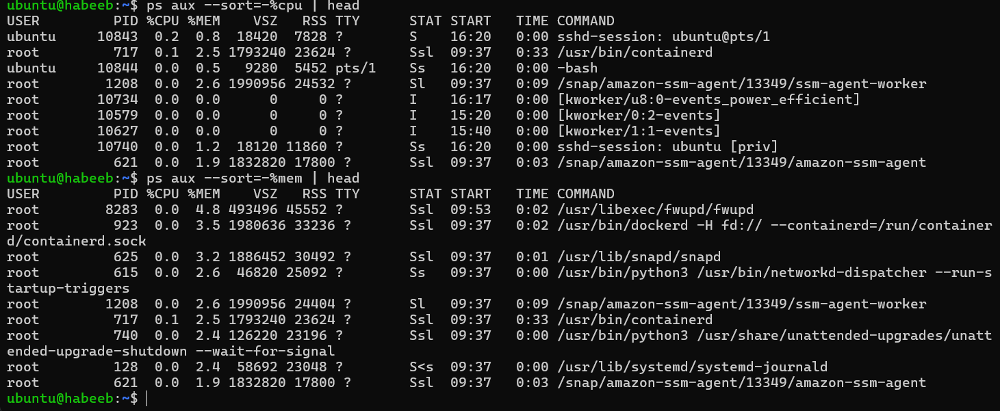
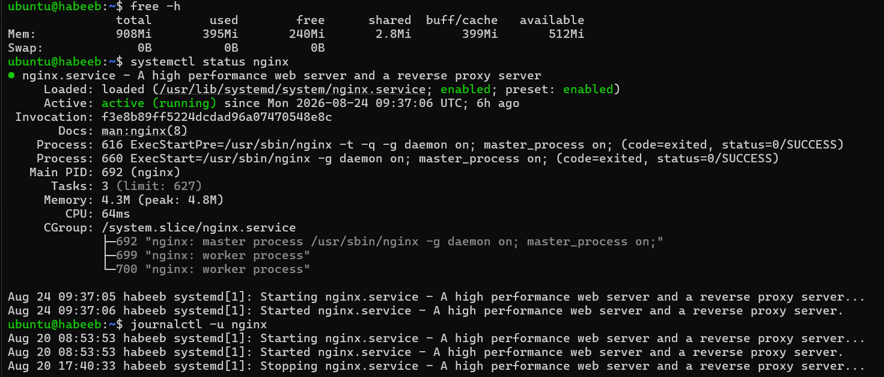
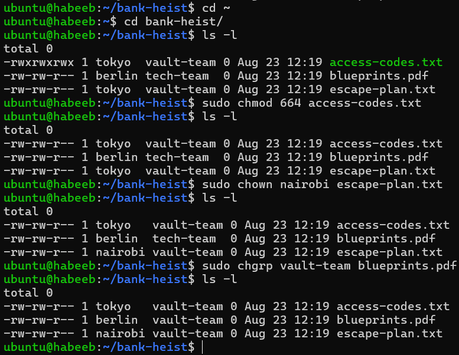
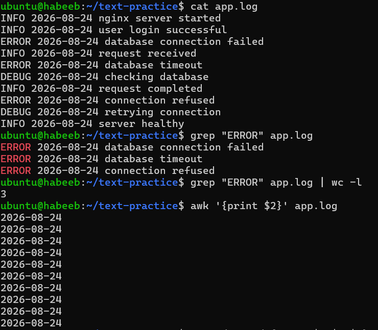
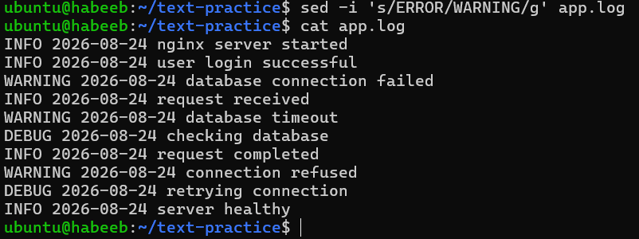

# Revision (Days 01-11)

* After completing Days 01–11, my goal is still the same.
I have become more comfortable with Linux, troubleshooting, AWS/EC2, users/groups, permissions and file ownership.

## Processes & Services

* I would check processes and services when a server or application is slow, unresponsive, or behaving unexpectedly.
* I'd prioritize CPU/memory/process checks first.
* `ps aux` or `ps aux --sort=-%cpu` - Find processes using the most memory
* `ps aux --sort=-%mem` - Find processes using the most memory
* `top` - Monitor processes in real time
* `free -h` - checks memory
* `systemctl status nginx` - checks service status (running or inactive)
* `journalctl -u nginx -n 10` - Checks service logs

* SSH troubleshooting - when i cannot connect through SSH:

* `systemctl status ssh`
* `ss -tlnp | grep :22`
* `journalctl -u ssh -n 10`

* I was able to remember most of the process and service commands without looking at my notes.

* My main refresh point was: `ss -tlnp | grep :22` I had remembered systemctl status ssh, but initially forgot the exact command for checking whether SSH was listening on port 22.

## File Skills

* I would use these commands when I need to create, modify, inspect, or manage files on a Linux server.
  
* `mkdir devops` - creates a directory
* `echo "Another line" >> notes.txt` - append to a file
* `chmod 640 notes.txt` - changes permission to (rw- , r--, ---)
* `sudo chown tokyo:developers notes.txt` - changes ownership with tokyo for users and developers for group to a notes.txt file.
* `ls -l` - before changing ownership,permissions i need to inspect the current state.

## Cheat-sheet refresh

* I would use these commands first when I face a Linux troubleshooting problem/incident.

1. `ps aux --sort=-%cpu` - I would use this when I suspect a process is consuming too much CPU.

2. `free -h`- I would use this when I suspect a memory problem.

3. `df -h` - I would use this when I suspect the disk is full.

4. `systemctl status <service>` - I would use this when an application/service is not working.

5. `journalctl -u <service>` - I would use this when I need to investigate service logs.

## User/Group Sanity

* I would use these commands when multiple users need access to the same project directory.

1. chown → change owner/group ownership
2. chgrp → change group ownership
3. chmod → change permissions

## Log analysis

* `grep` → Search `sed`  → Replace. `awk` → Extract / Process. `find` → Find files. `wc`   → Count.

## 4. What will I focus on improving in the next 3 days?

* Improve Linux command recall.
* Practice grep, sed and awk more.
* Become faster at troubleshooting real-world Linux problems.
* Continue connecting Linux fundamentals with practical DevOps scenarios.

