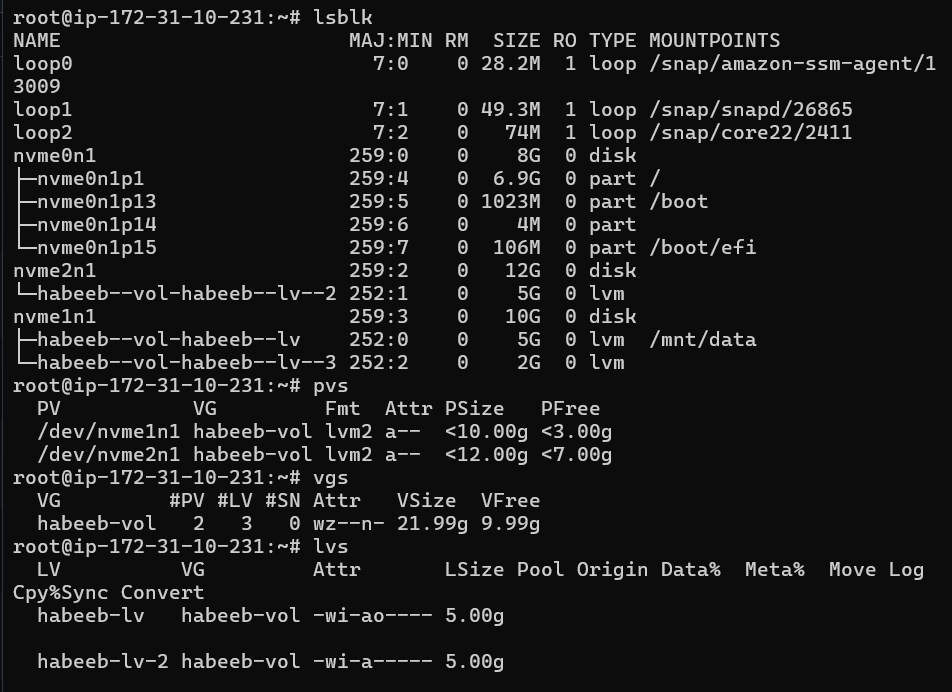
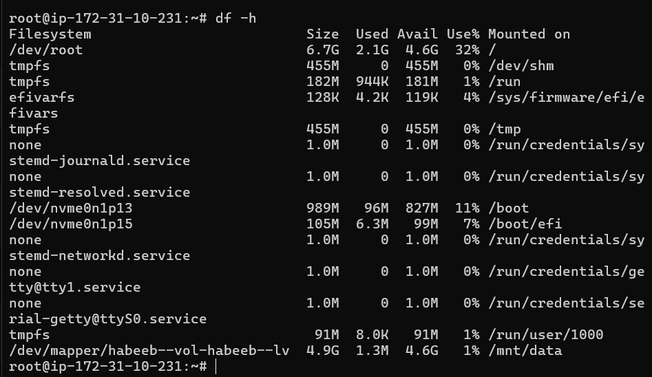
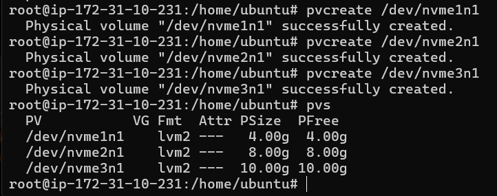
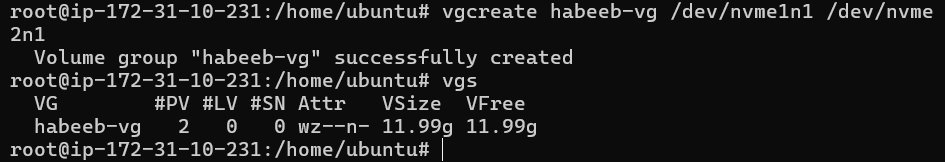
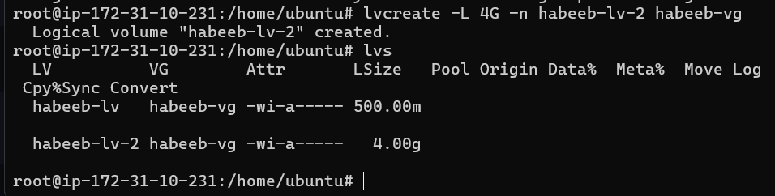
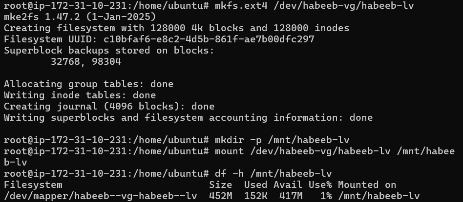
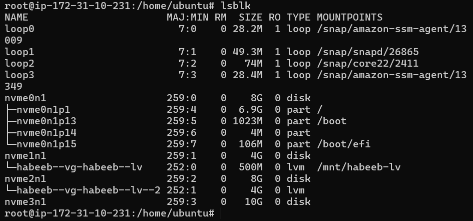
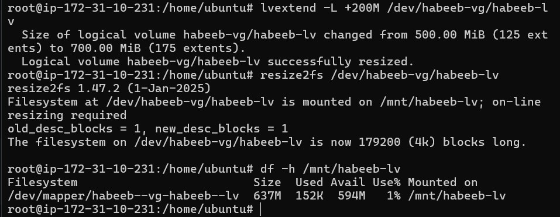

# Linux Volume Management (LVM)

## Task

```bash
LVM (Logical Volume Manager) is a Linux storage management system that provides flexible disk allocation
and resizing, making storage easier to manage and scale in DevOps environments.
```

## Switch to root user:

```bash
Run as root-user:
sudo su
```

## Task 1: Check Current Storage

```bash
Run:
`lsblk` — Lists available disks, partitions, and their storage hierarchy.
`pvs` — Displays information about Physical Volumes (PV).
`vgs` — Displays information about Volume Groups (VG).
`lvs` — Displays information about Logical Volumes (LV).
`df -h` — Shows filesystem disk usage in human-readable format.
```
## Output:





## Task 2: Create Physical Volume

```bash
pvcreate /dev/<devicename> #nvme1n1 or nvme2n1
pvs
```
## Output:



## Task 3: Create Volume Group

```bash
vgcreate habeeb-vg /dev/nvme1n1 /dev/nvme2n1
vgs
```
## Output:



## Task 4: Create Logical Volume

```bash
lvcreate -L 500M -n habeeb-lv habeeb-vg
lvs
```
## Output:



## Task 5: Format and Mount

```bash
mkfs.ext4 /dev/habeeb-vg/habeeb-lv
mkdir -p /mnt/habeeb-lv
mount /dev/habeeb-vg/habeeb-lv /mnt/habeeb-lv
df -h /mnt/habeeb-lv
```
## Output:





## Task 6: Extend the Volume

```bash
lvextend -L +200M /dev/habeeb-vg/habeeb-lv
resize2fs /dev/habeeb-vg/habeeb-lv
df -h /mnt/habeeb-lv
```
## Output:



## What i learned:

* Learned the LVM storage hierarchy: Physical Volumes (PV) → Volume Groups (VG) → Logical Volumes (LV).
* Learned how to create, manage, extend, format and mount LVM volumes.
* Practiced initializing disks as PVs, grouping them into VGs and creating LVs from them.
* Learned that after extending an LV, the filesystem must also be resized using `resize2fs`.

