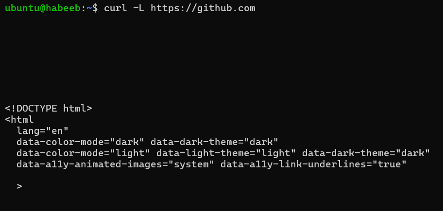
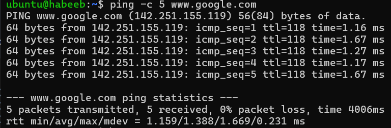
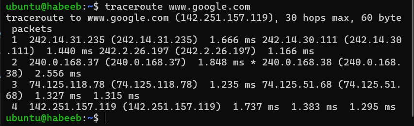
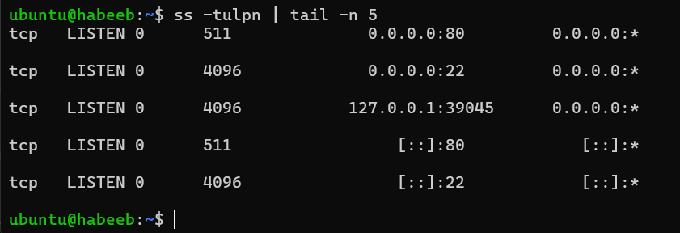
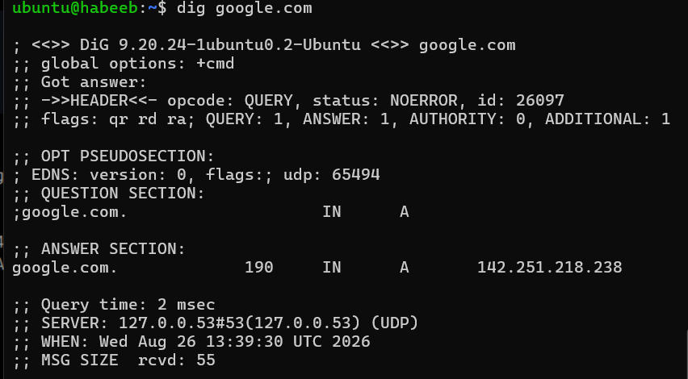
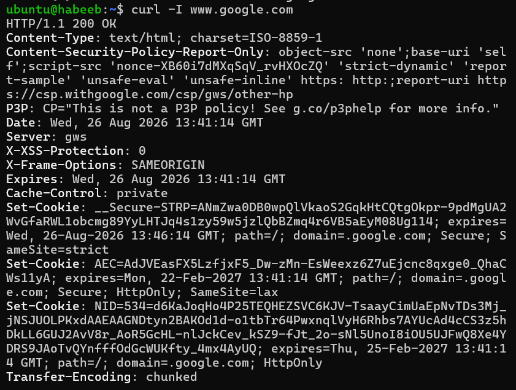
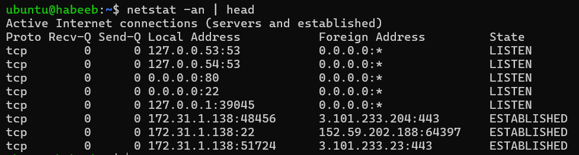
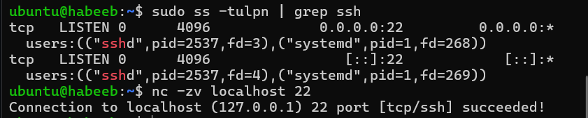

# Networking Fundamentals & Hands-on Checks

## OSI Model:

```bash
The OSI Model is a 7-layer conceptual model that defines network communication.
```
| Layer               | Function in one line                                                    |
| ------------------- | ----------------------------------------------------------------------- |
| **7. Application**  | Provides network services directly to applications (HTTP, FTP, DNS).    |
| **6. Presentation** | Handles data format, encryption, and compression.                       |
| **5. Session**      | Establishes, manages, and terminates communication sessions.            |
| **4. Transport**    | Provides end-to-end delivery, reliability, and flow control (TCP/UDP).  |
| **3. Network**      | Handles IP addressing and routing between networks.                     |
| **2. Data Link**    | Handles MAC addresses and delivery between devices on the same network. |
| **1. Physical**     | Transmits raw bits through cables, fiber, or wireless signals.          |

## TCP/IP Model:

```bash
The TCP/IP Model is a 4-layer practical model used by modern networks and the Internet.
```

| Layer                 | Function                                                                    |
| --------------------- | --------------------------------------------------------------------------- |
| **4. Application**    | Provides network services of applications + Combines Session & Presentation |
| **3. Transport**      | Provides end-to-end communication using TCP or UDP.                         |
| **2. Internet**       | Handles IP addressing and routing packets between networks.                 |
| **1. Network Access** | Handles communication over the local network and physical transmission.     |

## Where IP, TCP/UDP, HTTP/HTTPS, DNS sit in the stack:

* HTTP,HTTPS,DNS → Application layer

* TCP/UDP → Transport layer
  
* IP →  Internet layer.

## Real Example:

```bash
Curl -L sends an HTTPS request, TCP manages the connection
and IP handles addressing and routing the data to the server.
```



## Hands-on Checklist:
```bash
`hostname -I` = AWS priv IP addr is 172.31.1.138. 
```

```bash
`ping -c 5 www.google.com` - 0% packet loss with 4006ms avg latency.
```



```bash
`traceroute www.google.com` -  30 hops max, 60 byte packets.
```



```bash
`ss -tulpn` - SSH is listening on port 22.
```



```bash
`dig google.com` - Domain resolves to  142.251.218.238.
```



```bash
`curl -I www.google.com` - Received response HTTP/1.1 200 OK.
```



```bash
`netstat -an | head - quick view of the network ports and connections on this server.
```



## Mini Task: Port Probe & Interpret:

* SSH port listening on 22

* Connection succeeded



* If not reachable :

* Check service status - systemctl status ssh

* Check logs - journlctl -u ssh
