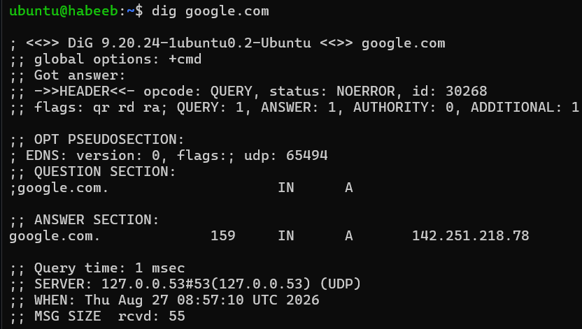
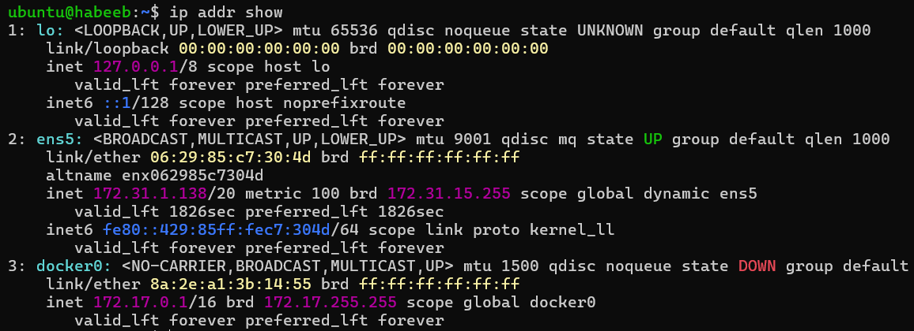
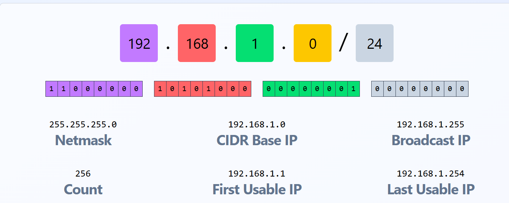

# Networking Concepts: DNS, IP, Subnets & Ports

## Task 1: How Names Become IP addresses

* What is DNS?
```bash

* DNS (Domain Name System) is like the phonebook of the internet. Humans remember the names like e.g: google.com
but computers understand and communicate using IP addresses. DNS helps translate names into IPs.
```

1. What happens when you type google.com in your browser?
```bash

Step 1- DNS finds the IP address using Cache or if not DNS resolver searches the IP.
Step 2- The computer connects to the website's server using that IP address.
Step 3- Then request is sent to the correct web server, sometimes through a load balancer
Step 4- The server processes my request and sends the webpage back to my browser.
```

2. What are these record types? Write one line each:
```bash

A : Connects a domain name to an IPv4 address.
AAAA : Connects a domain name to an IPv6 address.
CNAME : Creates an alias from one domain name to another.
MX : Specifies the server responsible for receiving emails for a domain.
NS : Names the DNS server responsible for a domain.
```
3. Run `dig google.com`



```bash
* A record - Maps a name to an IPv4 address. O/P: 142.251.218.78
* TTL (Time to Live) - How long a device remembers the address before checking again. Which is: 159 secs
```

## Task 2: IP Addressing

1. What is an IP address? How is it structured?
```bash
An IP address is like an phone number for a computer. It allows devices to locate and talk to each other.
-> Structure:
* 192.168.1.10
* Network portion = City/Area (192.168.1)
* Host portion = Specific house (10)
```

2. Difference between public and private IPs.

```bash
* Public IP: Routable on the internet ( like a business phone number)
* Private IP : Not Routable on the internet ; used inside a company network (internal)
```
3. What are the private IP ranges?

```bash
10.0.0.0/8 - Large private networks - commonly used in companies, AWS VPCs, data center.
172.16.0.0/12 - Medium-sized private networks - commonly used in organizations and Docker networks
192.168.0.0/16 - Small/home networks - commonly used by Wi-Fi routers and home devices.
```
4. Run: `ip addr show`



```bash
127.0.0.1 - For local communication on the computer itself.
172.31.1.138 - is the private IP address assigned to my instance.
```

## Task 3: CIDR & Subnetting

1. What does /24 mean in 192.168.1.0/24?



```bash
/24 means the first 24 bits are used for the network portion, and the remaining 8 bits are used for hosts.
```

2. How many usable hosts in :

```bash
/16: 65,536
/24: 256
/28: 16
Source: cidr.xyz
```
3. Why do we subnet?

```bash
Subnetting is slicing is a large network into small slices (subnets) to share it effectively.
E.g.
Company Network
├── Web Servers     → Subnet 1
├── Database        → Subnet 2
├── Employees       → Subnet 3
└── Management      → Subnet 4
```
4. Quick exercise — fill in:

| CIDR | Subnet Mask     | Total IPs | Usable Hosts |
|------|-----------------|-----------|--------------|
| /24  | 255.255.255.0   | 256       | 254          |
| /16  | 255.255.0.0     | 65,536    | 65,534       |
| /28  | 255.255.255.240 | 16        | 14           |

## Task 4: Ports – The Doors to Services

1. What is a port? Why do we need them?

```bash
-> If IP address is the building , then `port` is the door which allows a specific
   network service or application to communicate.
-> Port is needed to differentiate between services, allowing multiple services to
   run on the same machine and still be uniquely identified.
```

2. Document these common ports:

| Port | Service |
|------|---------|
| 22   | SSH     |
| 80   | Nginx   |
| 443  | HTTPS   |
| 53   | DNS     |
| 3306 | MySQL   |
| 6379 | Redis   |
| 27017| MongoDB |

3. Run `ss -tulpn` - match at least 2 listening ports to their services

```bash
- Port 22 : Service SSH
- Port 53 : DNS
```

## Task 5: Putting It Together

1. Run `curl http://localhost:80/webpage.html` - what networking concepts from today are involved?

```bash
IP Address → localhost refers to your own machine (127.0.0.1).
Port → 80 is the port used for HTTP.
HTTP → curl sends an HTTP request to Nginx, and Nginx sends the webpage back.
```
2. Your app can't reach a database at 10.0.1.50:3306 — what would you check first?

```bash
ss -tulpn | grep 3306 - Check if port is open and service is listening.
systemctl status mysql - Checks service status
nc -zv 10.0.1.50 3306 - Check port connectivity
journalctl -u mysql - Check recent logs
```

