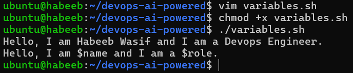
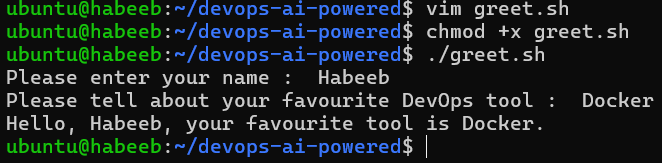
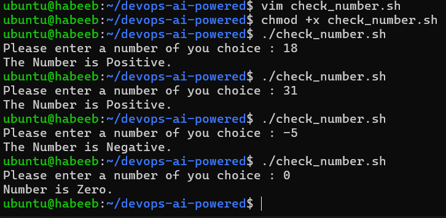
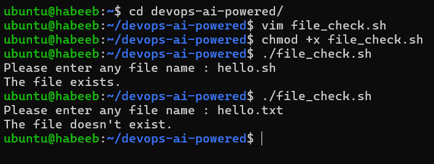
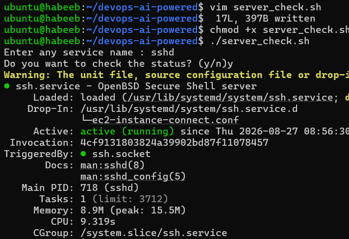
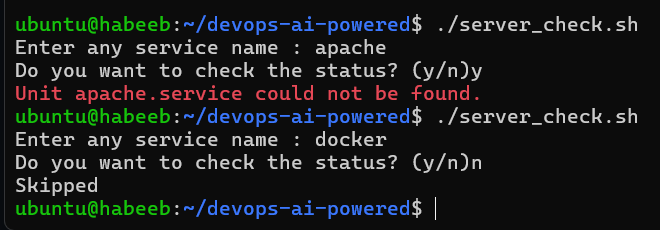

# Shell Scripting Basics:

## Task 1: First Script

1. Create a file `hello.sh`
2. Add the shebang line `#!/bin/bash` at the top
3. Print `Hello, DevOps!` using `echo`
4. Make it executable and run it

[View my script file:](Scripts/hello.sh)

* What happens if you remove the shebang line?

`./hello.sh` - If there is no shebang found, the current shell itself can end up 
interpreting the file.

`- #!/bin/bash` - shebang helps us explicitly tell that this file should be interpreted by..! to the kernel.

## Task 2: Variables
1. Create `variables.sh` with:
   - A variable for your `NAME`
   - A variable for your `ROLE` (e.g., "DevOps Engineer")
   - Print: `Hello, I am <NAME> and I am a <ROLE>`
2. Try using single quotes vs double quotes — what's the difference?
 * Using double quote `" "` - The variables and commands are evaluated.
 * Using single quote `' '` - Everything inside is taken literally, no evaluation happens.

[View my script file:](Scripts/variables.sh)

### Try using single quotes vs double quotes — what's the difference?

## Task 3: User Input with read

* Create greet.sh that:
  - Asks the user for their name using read
  - Asks for their favourite tool
  - Prints: Hello <name>, your favourite tool is <tool>

[View my script file:](Scripts/greet.sh)

## Task 4: If-Else Conditions

1. Create `check_number.sh` that:
   - Takes a number using `read`
   - Prints whether it is **positive**, **negative**, or **zero**

[View my script file:](Scripts/check_number.sh)

2. Create `file_check.sh` that:
   - Asks for a filename
   - Checks if the file **exists** using `-f`
   - Prints appropriate message.

[View my script file:](Scripts/file_check.sh)

## Task 5: Combine It All
Create `server_check.sh` that:
1. Stores a service name in a variable (e.g., `nginx`, `sshd`)
2. Asks the user: "Do you want to check the status? (y/n)"
3. If `y` — runs `systemctl status <service>` and prints whether it's **active** or **not**
4. If `n` — prints "Skipped."

[View my script file:](Scripts/server_check.sh)

