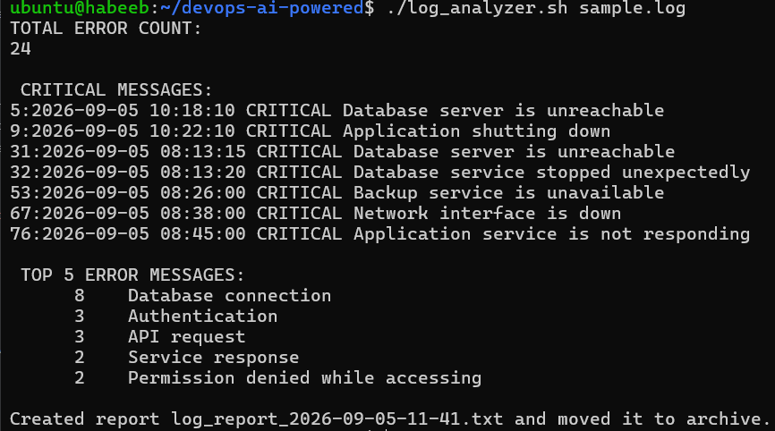
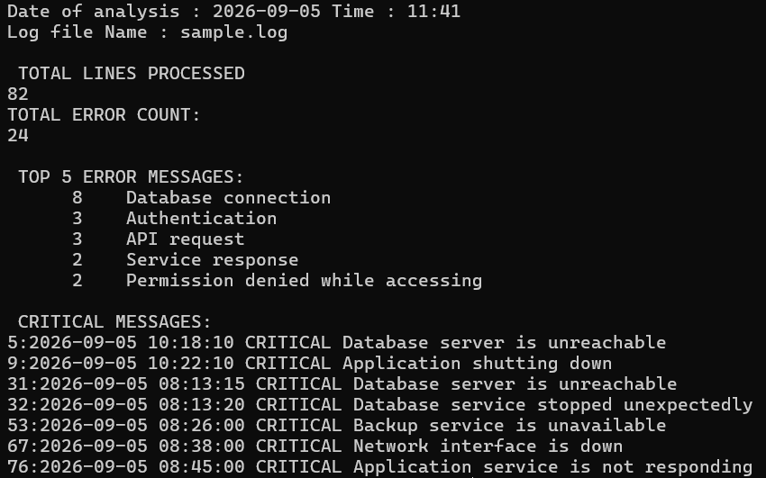

# Bash Scripting Challenge: Log Analyzer and Report Generator

## Task 1: Input and Validation
Your script should:
1. Accept the path to a log file as a command-line argument
2. Exit with a clear error message if no argument is provided
3. Exit with a clear error message if the file doesn't exist

### Solution:
```bash
usage(){
	echo "Usage: ./log_analyzer.sh /path/to/logfile"
	echo "Provide the log file that you want to analyze."
	exit 1
}

check_file(){
	if [ -f $fname ];then
		:
	else
		echo "File doesn't exists"
	fi
}
```

## Task 2: Error Count
1. Count the total number of lines containing the keyword `ERROR` or `Failed`
2. Print the total error count to the console

### Solution:
```bash
error_count(){
	echo "TOTAL ERROR COUNT:"
	grep -ic "ERROR" $fname
}
```

## Task 3: Critical Events
1. Search for lines containing the keyword `CRITICAL`
2. Print those lines along with their line number

### Solution:
```bash
critical_events(){
	echo -e "\n CRITICAL MESSAGES:"
	grep -n "CRITICAL" $fname
}
```

## Task 4: Top Error Messages
1. Extract all lines containing `ERROR`
2. Identify the **top 5 most common** error messages
3. Display them with their occurrence count, sorted in descending order

### Solution:
```bash
top5_error(){
	echo -e "\n TOP 5 ERROR MESSAGES:"
	grep "ERROR" $fname | awk '{$1=$2=$3=$NF=""; print}' | sort | uniq -c | sort -nr | head -5
}
```

## Task 5: Summary Report
Generate a summary report to a text file named `log_report_<date>.txt`. The report should include:
1. Date of analysis
2. Log file name
3. Total lines processed
4. Total error count
5. Top 5 error messages with their occurrence count
6. List of critical events with line numbers

### Solution:
```bash
report(){
	report="log_report_$(date +%Y-%m-%d-%H-%M).txt"
	echo "Date of analysis : $(date +%Y-%m-%d" Time : "%H:%M)" >> $report
	echo "Log file Name : $fname" >> $report
	total_lines >> $report
	error_count >> $report
	top5_error >> $report
	critical_events >> $report
}
```

## Task 6 (Optional): Archive Processed Logs
Add a feature to:
1. Create an `archive/` directory if it doesn't exist
2. Move the processed log file into `archive/` after analysis
3. Print a confirmation message

### Solution:
```bash
move(){
	mkdir -p archive
	mv $report archive
	echo -e "\nCreated report $report and moved it to archive."
}
```

## OUTPUT for Log Analyzer

[View my Script](log_analyzer.sh)





[View my Report file](archive/log_report_2026-09-05-11-41.txt)

