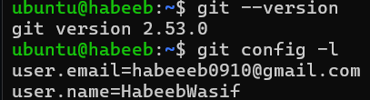
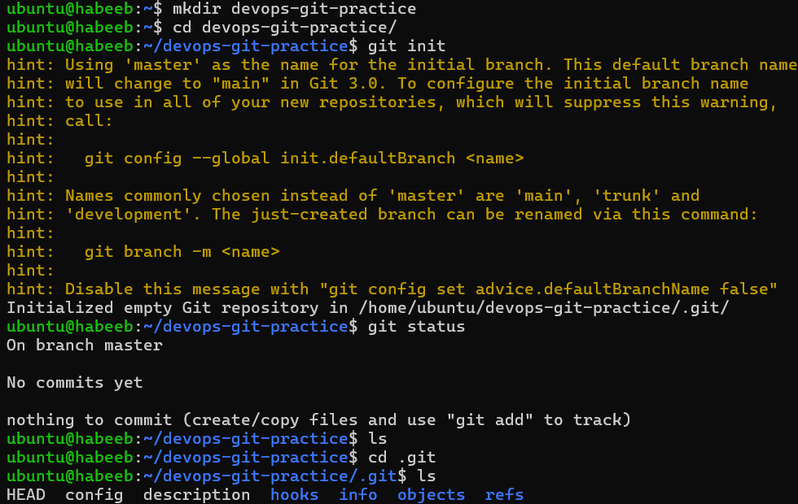
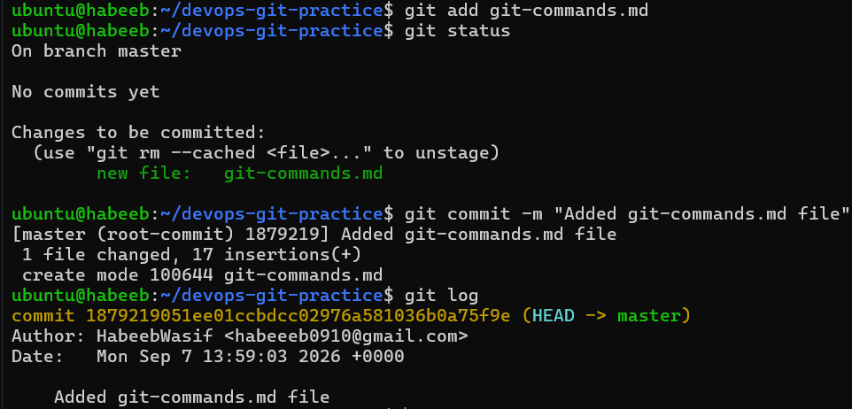
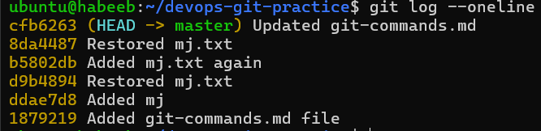

# Introduction to Git: My First Repository

## Task 1: Install and Configure Git
1. Verify Git is installed on your machine
2. Set up your Git identity — name and email
3. Verify your configuration


   
---

## Task 2: Create Your Git Project
1. Create a new folder called `devops-git-practice`
2. Initialize it as a Git repository
3. Check the status — read and understand what Git is telling you
4. Explore the hidden `.git/` directory — look at what's inside



---

## Task 3: Created "git-commands.md"

[View it here](git-commands.md)

## Task 4: Stage and Commit
1. Stage your file
2. Check what's staged
3. Commit with a meaningful message
4. View your commit history


   
---

## Task 5: Make More Changes and Build History
1. Edit `git-commands.md` — add more commands as you discover them
2. Check what changed since your last commit
3. Stage and commit again with a different, descriptive message
4. Repeat this process at least **3 times** so you have multiple commits in your history
5. View the full history in a compact format


   
---

## Task 6: Understand the Git Workflow

1. What is the difference between `git add` and `git commit`?

Answer:
```bash

`git add`- Keeps the file in Staging Area.

`git commit` - Saves my staged changes to my local project history.

```
2. What does the **staging area** do? Why doesn't Git just commit directly?

Answer:
```bash

The staging area lets you choose exactly which changes to include in a commit, giving you
control before permanently saving them in Git’s history.
```

3. What information does `git log` show you?

Answer:
```bash
`git log` - Shows Commit History.
```

4. What is the `.git/` folder and what happens if you delete it?

Answer:
```bash
The .git/ folder contains all of a repository’s Git history, configuration, branches, and tracking information but
deleting it removes Git tracking/history from that project.
```

5. What is the difference between a **working directory**, **staging area**, and **repository**?

Answer:
```bash
Working directory → Where you edit/create files.
Staging area → Where you select changes to include in the next commit (git add).
Repository → Where Git stores committed changes and history (git commit).
```

---
