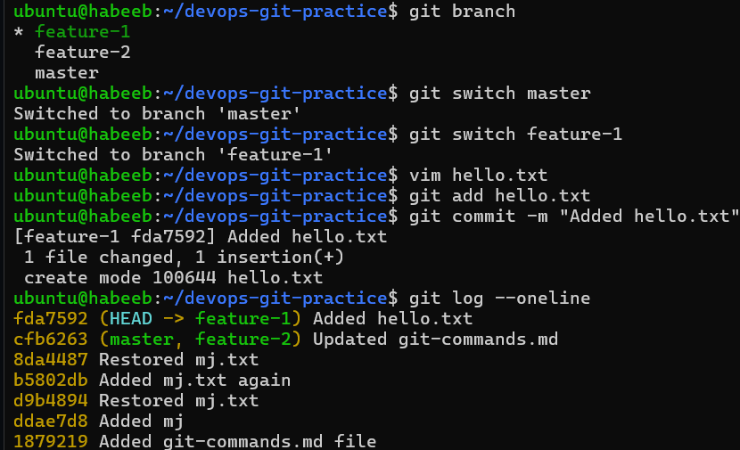
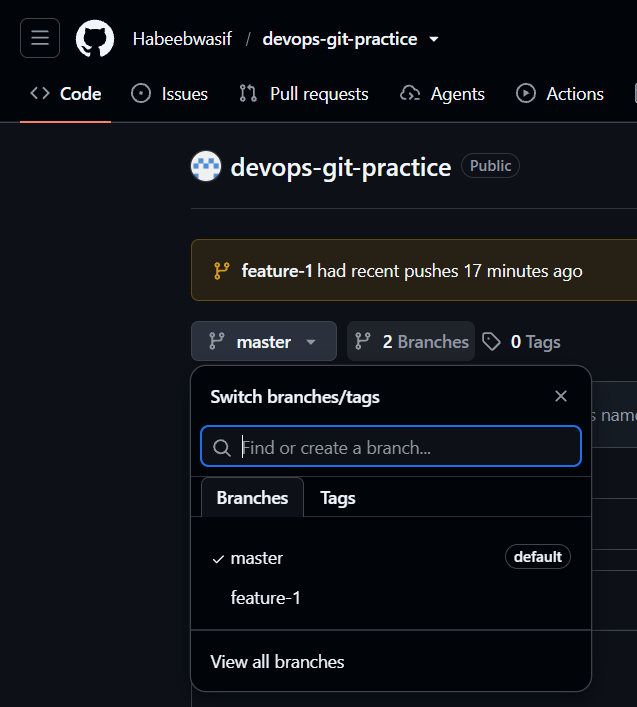
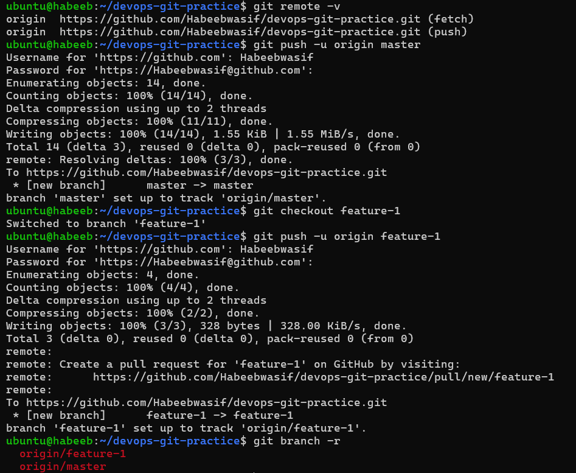

# Git Branching & Working with GitHub
---
## Task 1: Understanding Branches

### 1. What is a branch in Git?
```bash
A branch is a separate line of development in Git. It allows me to work on
changes without affecting the main branch.
```
### 2. Why do we use branches instead of committing everything to `main`?
```
Branches keep new or experimental work separate from `main` so the main
code stays stable and working.
```
### 3. What is `HEAD` in Git?
```
`HEAD` is a pointer that tells Git which branch or commit I'm currently
working on.
```
### 4. What happens to your files when you switch branches?
```
When i switch branches, Git updates my working directory to match the
files and changes stored in that branch.
```
---

## Task 2: Branching Commands — Hands-On

1. List all branches in your repo
2. Create a new branch called `feature-1`
3. Switch to `feature-1`
4. Create a new branch and switch to it in a single command — call it `feature-2`
5. Try using `git switch` to move between branches — how is it different from `git checkout`?
6. Make a commit on `feature-1` that does **not** exist on `main`
7. Switch back to `main` — verify that the commit from `feature-1` is not there
8. Delete a branch you no longer need
9. Add all branching commands to your `git-commands.md`



---

## Task 3: Push to GitHub

1. Create a **new repository** on GitHub (do NOT initialize it with a README)
2. Connect your local `devops-git-practice` repo to the GitHub remote
3. Push your `main` branch to GitHub
4. Push `feature-1` branch to GitHub
5. Verify both branches are visible on GitHub
6. Answer in your notes:
   
   * What is the difference between `origin` and `upstream`?
     
   ```
   * `Origin` -  Points to my remote repository.
   * `Upstream` - Points to the repository that i forked from.
   ```
    




---

## Task 4: Pull from GitHub

1. Make a change to a file **directly on GitHub** (use the GitHub editor)
2. Pull that change to your local repo
3. Answer in your notes:
   
   * What is the difference between `git fetch` and `git pull`?
     
   ```
   `git fetch` → Downloads changes from GitHub but does not change my working files or current branch.
   `git pull` → Downloads changes and immediately merges them into my current branch.
   ```
---

## Task 5: Clone vs Fork
1. **Clone** any public repository from GitHub to your local machine
2. **Fork** the same repository on GitHub, then clone your fork
3. Answer in your notes:
   
   * What is the difference between clone and fork?
     
     ```
     `Clone` → Copies a GitHub repository to your computer so you can work on it locally.
     `Fork` → Creates a copy of someone else's repository in your own GitHub account.
     ```
   * When would you clone vs fork?
  
     ```
     `Clone` = I want a local copy to work on.
     `Fork` = I want my own GitHub copy of someone else's project.
     ```
   * After forking, how do you keep your fork in sync with the original repo?

     ```
     Fetch from upstream → merge into your branch → push to origin.
     Where:
     `origin` → my fork
     `upstream` → original repository
     ```

---
