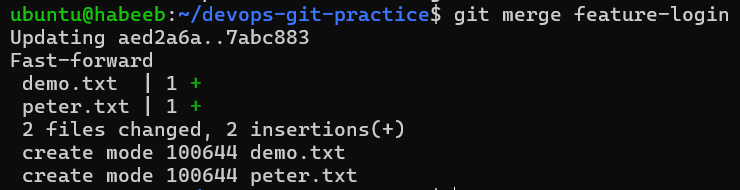
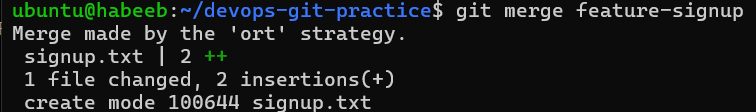
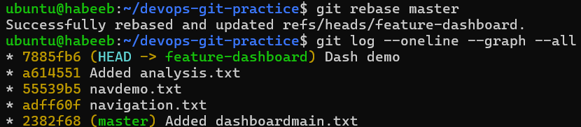
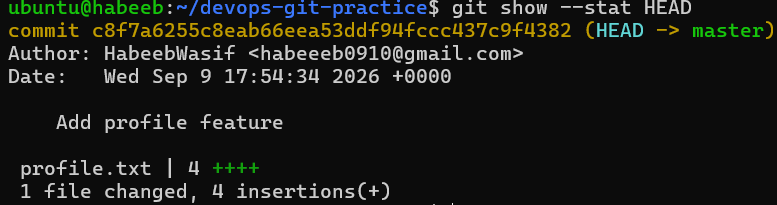
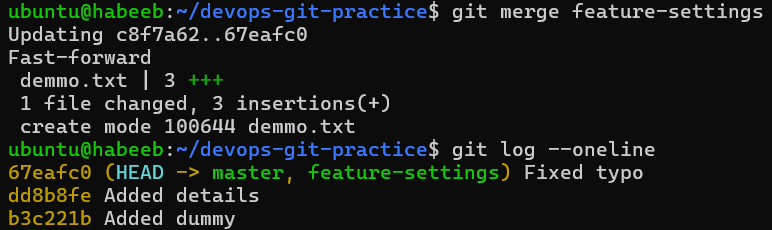
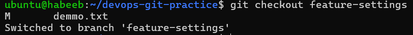
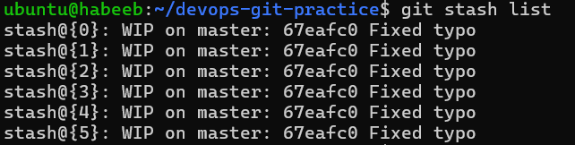
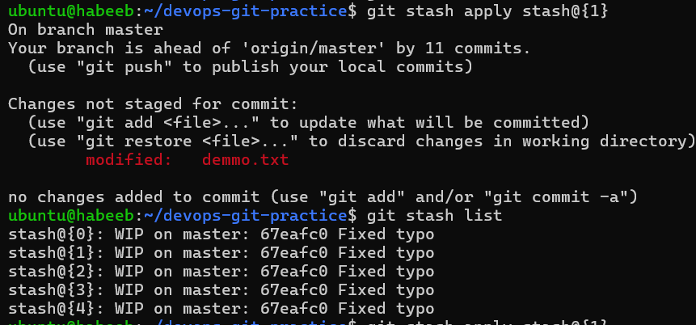
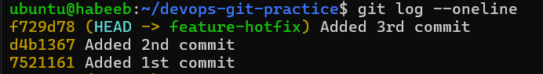
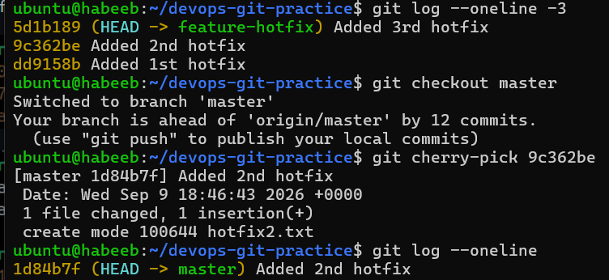

# Advanced Git: Merge, Rebase, Stash & Cherry Pick

## Task 1: Git Merge — Hands-On

1. Create a new branch `feature-login` from `main`, add a couple of commits to it
2. Switch back to `main` and merge `feature-login` into `main`
3. Observe the merge — did Git do a **fast-forward** merge or a **merge commit**?
  * **fast-forward**
  

     
4. Now create another branch `feature-signup`, add commits to it — but also add a commit to `main` before merging
5. Merge `feature-signup` into `main` — what happens this time?
 * **merge commit**
 

    
6. Answer in your notes:

```bash
- What is a fast-forward merge?

Answer: It merges two branches without creating a new commit. Instead, it simply moves the current branch’s 
       pointer forward to match the branch being merged.
    
- When does Git create a merge commit instead?
    

Answer: When you try to merge two branches that have diverged. the merge commit combines the changes from both branches.
     

- What is a merge conflict? (try creating one intentionally by editing the same line in both branches)
    
    
Answer:  A merge conflict occurs when Git cannot automatically combine changes from two branches,
        usually because both branches modified the same line of the same file differently.
        Git asks you to manually choose which changes to keep.
```
     
---

## Task 2: Git Rebase — Hands-On

1. Create a branch `feature-dashboard` from `main`, add 2-3 commits
2. While on `main`, add a new commit (so `main` moves ahead)
3. Switch to `feature-dashboard` and rebase it onto `main`
4. Observe your `git log --oneline --graph --all` — how does the history look compared to a merge?



5. Answer in your notes:

```bash
- What does rebase actually do to your commits?

Answer: Rebase creates linear history.

- How is the history different from a merge?

Answer: Rebase creates a linear history, while merge preserves the branching history and
        usually creates a merge commit.

- Why should you **never rebase commits that have been pushed and shared** with others?

Answer: Because rebase rewrites commit history. If others have already pulled those commits,
       then it will create confusion and conflicts.

- When would you use rebase vs merge?
Answer: Use rebase for a clean linear history on private/local work and
        merge when preserving shared branch history is important.

```
---
## Task 3: Squash Commit vs Merge Commit

1. Create a branch `feature-profile`, add 4-5 small commits (typo fix, formatting, etc.)
2. Merge it into `main` using `--squash` — what happens?




    
3. Check `git log` — how many commits were added to `main`?
4. Now create another branch `feature-settings`, add a few commits
5. Merge it into `main` **without** `--squash` (regular merge) — compare the history


    
6. Answer in your notes:
   
```bash
- What does squash merging do?
   
Answer: Squash merging combines multiple commits from a branch into a single commit.

- When would you use squash merge vs regular merge?
   
Answer: If one file has multiple commits, then squashing is better. Else regular merge.
   
- What is the trade-off of squashing?
   
Answer: Detailed commit history is lost from feature branch as only one commit will be shown in main branch.

```
---

## Task 4: Git Stash — Hands-On

1. Start making changes to a file but **do not commit**
2. Now imagine you need to urgently switch to another branch — try switching. What happens?


    
3. Use `git stash` to save your work-in-progress
4. Switch to another branch, do some work, switch back
5. Apply your stashed changes using `git stash pop`
6. Try stashing multiple times and list all stashes
7. Try applying a specific stash from the list


    

    
8. Answer in your notes:

```bash
- What is the difference between `git stash pop` and `git stash apply`?
Answer: `git stash pop` restores and removes the stash, while `git stash apply` restores it but keeps the stash.

- When would you use stash in a real-world workflow?
Answer: When an urgent fix comes up, I would stash changes from my current branch and switch to another branch 
        to work on urgent fix first.
```
---

## Task 5: Cherry Picking

1. Create a branch `feature-hotfix`, make 3 commits with different changes
2. Switch to `main`
3. Cherry-pick **only the second commit** from `feature-hotfix` onto `main` 
4. Verify with `git log` that only that one commit was applied


    

    
5. Answer in your notes:

```bash
- What does cherry-pick do?
Answer: It lets you pick and apply one/range commit from another branch to your current branch instead of merging all.

- When would you use cherry-pick in a real project?
Answer: Suppose I made 3 changes but I want only one changes to be applied to main branch. Then I would cherry-pick
       that single commit instead of merging the whole branch

- What can go wrong with cherry-picking?
Answer: If the same branch is merged then it will create duplicate commits and
        it may create conflicts if the commit depends on previous commits.
```
