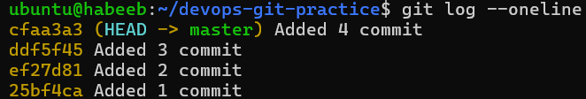
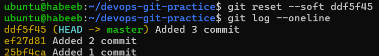
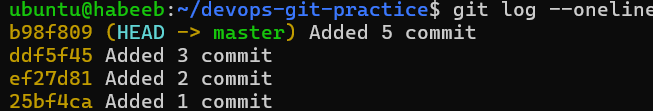
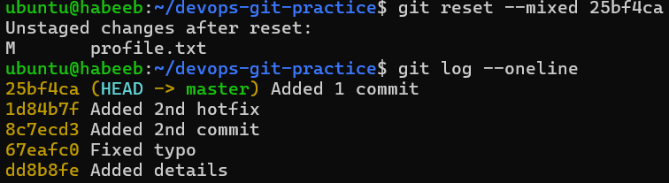
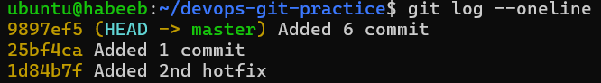
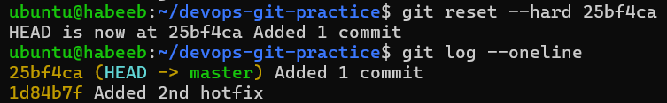
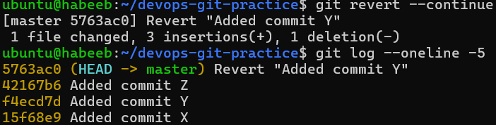
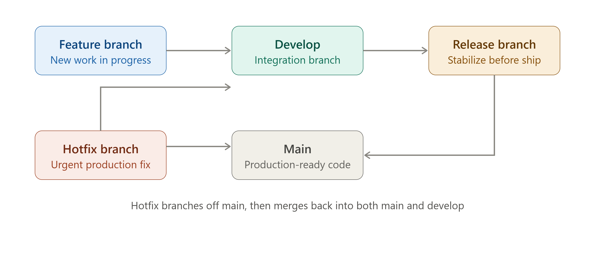
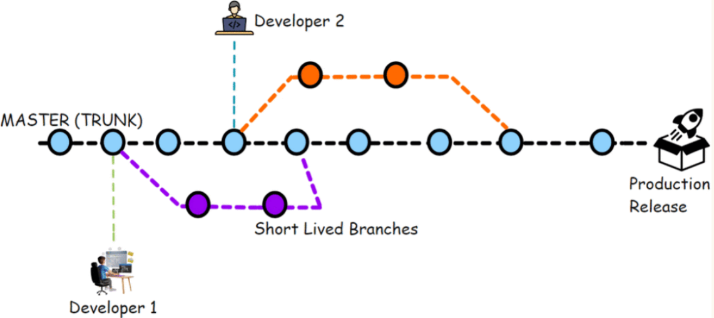

# Git Reset vs Revert & Branching Strategies

## Task 1: Git Reset — Hands-On

1. Make 3 commits in your practice repo (commit A, B, C)



3. Use `git reset --soft` to go back one commit — what happens to the changes?



```bash

'git reset --soft` / `git reset --soft #<commit-id> - Moves back one commit but it keeps the changes staged.

```

3. Re-commit, then use `git reset --mixed` to go back one commit — what happens now?





```bash

`git reset --mixed` - Moves back one commit and keeps the changes unstaged in the working directory.

```

4. Re-commit, then use `git reset --hard` to go back one commit — what happens this time?





```bash

`git reset --hard` - Moves back one commit and deletes the changes from the working directory.

```

5. Answer in your notes:

```bash

   - What is the difference between `--soft`, `--mixed`, and `--hard`?

     * `--soft` - Removes commits but keeps changes still staged.
     * `--mixed` - Removes commits and keeps changes unstaged.
     * `--hard` - Removes commits and completely deletes changes.

   - Which one is destructive and why?
     * `--hard` is destructive because it permanently deletes history and changes.

   - When would you use each one?
     * `--soft` - to change commit message.
     * `--mixed` - to modify changes.
     * `--hard` - to remove all changes.

   - Should you ever use `git reset` on commits that are already pushed?
     * No we should avoid doing that because it rewrites history and cause conflicts.
```

---

## Task 2: Git Revert — Hands-On

1. Make 3 commits (commit X, Y, Z)
2. Revert commit Y (the middle one) — what happens?
3. Check `git log` — is commit Y still in the history?

Answer:
```bash
Revert commit Y: Git creates a new commit that undoes Y's changes, while keeping X and Z.
Yes, commit Y is still in the history because it adds a new revert commit.
```


4. Answer in your notes:

```bash
- How is `git revert` different from `git reset`?
Difference: It creates a new commit to undo changes and git reset moves the branch back and can remove commits from history.

- Why is revert considered **safer** than reset for shared branches?
Revert does not rewrite history so it does not disrupt other people's work nor arise conflicts

- When would you use revert vs reset?
I'd use revert for pushed/shared commits and reset when the commits are not necessary and should be deleted from history

```
---

## Task 3: Reset vs Revert — Summary

| | `git reset` | `git revert` |
|---|---|---|
| What it does | Moves the branch back to an earlier commit | Creates a new commit that undoes changes |
| Removes commit from history? | Yes | No |
| Safe for shared/pushed branches? | No | Yes |
| When to use | To completely remove commit and its changes. | To preserve history while safely undoing changes. |

---

## Task 4: Branching Strategies

1.GitFlow:



```bash
How it works:
- GitFlow keeps a permanent `develop` branch for integration.
- `Feature` branches merge into develop when it's time to ship,
- a `release` branch stabilizes the code before merging into main.
- Urgent fixes get their own `hotfix` branch off main, which merges back into both main and develop
  so the fix isn't lost.

When/where it's used:
- Projects with scheduled releases, versioned software, or products that must
  support multiple release versions in parallel (e.g., enterprise software, mobile apps with app-store release cycles).

- Pros : Everything perfectly tracked.
- Cons : Can be complex and difficult to manage.

```

2.GitHub Flow:


```bash
How it works:
A single long-lived main branch stays always-deployable, and every change is made on a short-lived feature branch
that's merged back into main via a pull request after review.

When/where it's used:
- Web apps and services using continuous delivery/deployment,
where you want to ship to production frequently and simply
(common in SaaS teams, open-source projects on GitHub).

- Pros : Simple, lightweight.
- Cons : Not properly structured. Can become messy if not disciplined, since everything merges directly into main. 

```

3.Trunk-Based Development:



```bash

How it works: 
Everyone commits directly (or via very short-lived branches, often less than a day)
to a single shared trunk/main, 
relying on feature flags to hide incomplete work rather than long-lived branches.

When/where it's used: 
High-velocity teams practicing continuous integration/deployment, often paired with feature flags

Pros: Minimal merge conflicts and fast, truly continuous integration since branches barely exist.
Cons: It demands strong automated testing and feature-flag discipline, or broken code lands straight on trunk.

```

4.Answer:

```bash
   * Which strategy would you use for a startup shipping fast?
    - GitHub flow mainly because trunk based requires strong knowledge and discipline.

   * Which strategy would you use for a large team with scheduled releases?
     - GitFlow because its develop/release/hotfix structure suits teams coordinating, versioned releases and needing to patch older versions in production.

   * Which one does your favorite open-source project use? (check any repo on GitHub)
     - GitHub-flow
```
