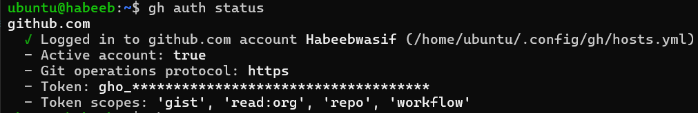
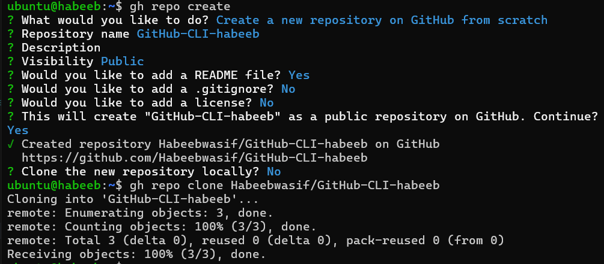
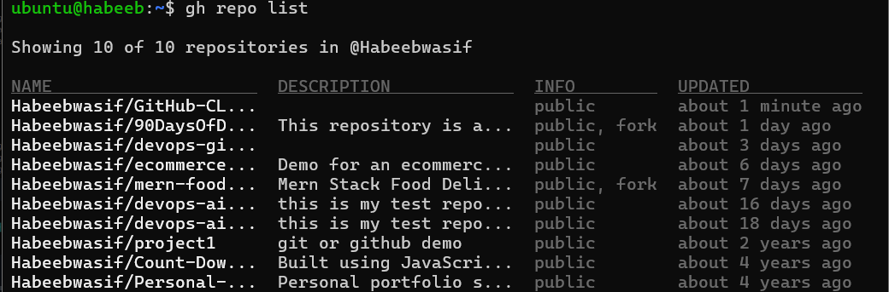
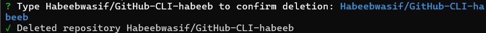
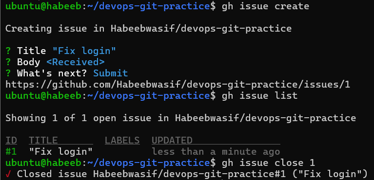
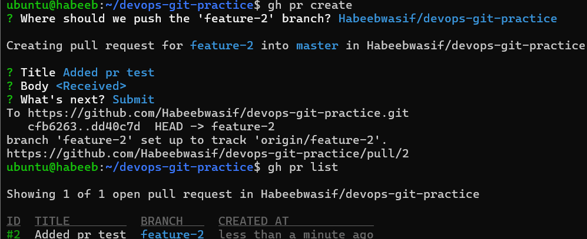
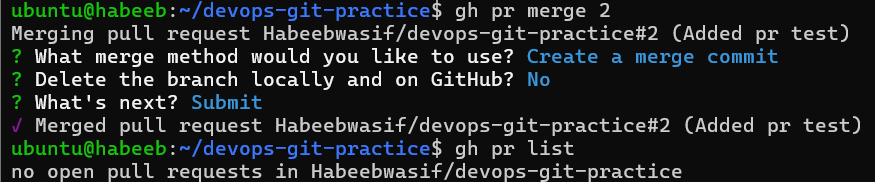
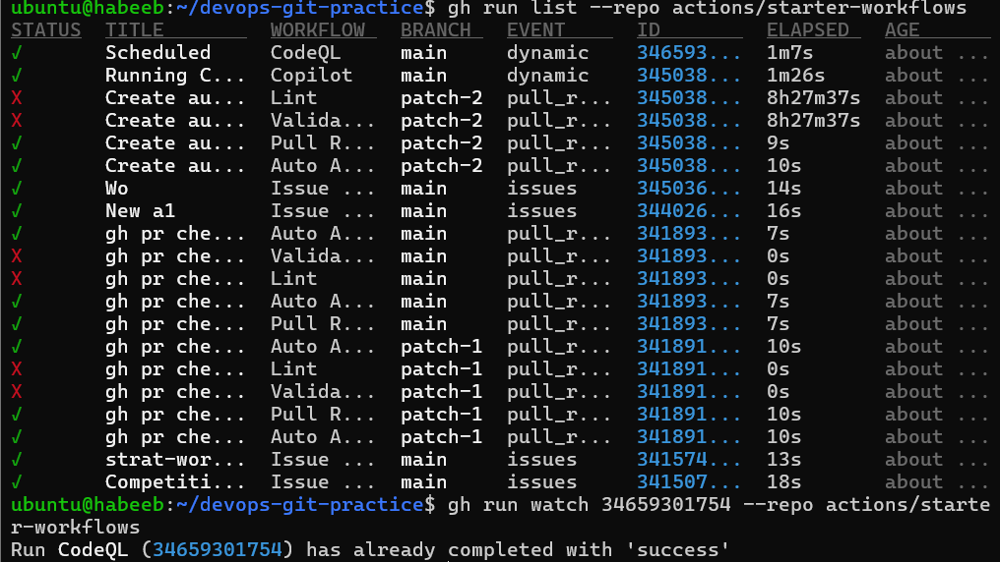

# Day 26 – GitHub CLI: Manage GitHub from Your Terminal

## Task 1: Install and Authenticate
1. Install the GitHub CLI on your machine
2. Authenticate with your GitHub account
3. Verify you're logged in and check which account is active

4. Answer in your notes:
```bash

Q. What authentication methods does `gh` support?

- Web based browser loginn & personal access token

```


---

## Task 2: Working with Repositories
1. Create a **new GitHub repo** directly from the terminal — make it public with a README
2. Clone a repo using `gh` instead of `git clone`
3. View details of one of your repos from the terminal
4. List all your repositories
5. Open a repo in your browser directly from the terminal
6. Delete the test repo you created (be careful!)







---

## Task 3: Issues
1. Create an issue on one of your repos from the terminal — give it a title, body, and a label
2. List all open issues on that repo
3. View a specific issue by its number
4. Close an issue from the terminal

5. Answer in your notes:

```bash  
How could you use `gh issue` in a script or automation?

Answer: By combining gh issue commands in a script, you can automate workflows such as:

gh issue create --title "Bug" --body "Login issue" --label "bug"  # Create
gh issue list                                                    # List
gh issue view 1                                                  # View
gh issue edit 1 --title "Updated title"                          # Edit
gh issue comment 1 --body "Working on this"                      # Comment
gh issue close 1                                                 # Close
gh issue reopen 1                                                # Reopen
gh issue delete 1                                                # Delete

```


## Task 4: Pull Requests
1. Create a branch, make a change, push it, and create a **pull request** entirely from the terminal
2. List all open PRs on a repo
3. View the details of your PR — check its status, reviewers, and checks
4. Merge your PR from the terminal





5. Answer in your notes:

```bash

Q. What merge methods does `gh pr merge` support?

`--merge` - Merge commit
`--squash`- Combines commits into one
`--rebase`- Replays commits without merge commit

Q. How would you review someone else's PR using `gh`?

Some of the commands researched are:

`gh pr view` - helps understand the PR (ex: gh pr view <id>)

`gh pr diff` - reviews the actual code changes

`gh pr checks` - verifies CI status i guess

`gh pr review` - lets us approve, comment, or request changes

```

---

## Task 5: GitHub Actions & Workflows (Preview)
1. List the workflow runs on any public repo that uses GitHub Actions
2. View the status of a specific workflow run
3. Answer in your notes:

```bash
Q. How could `gh run` and `gh workflow` be useful in a CI/CD pipeline?

`gh run` is used to monitor and manage CI/CD workflow runs, (ex: gh run watch <run-id>)
while `gh workflow` is used to view, trigger, (ex: gh workflow view <workflow>)
enable, or disable GitHub Actions workflows.

Together, they help automate and manage testing, builds, and deployments from the terminal.
```




---

