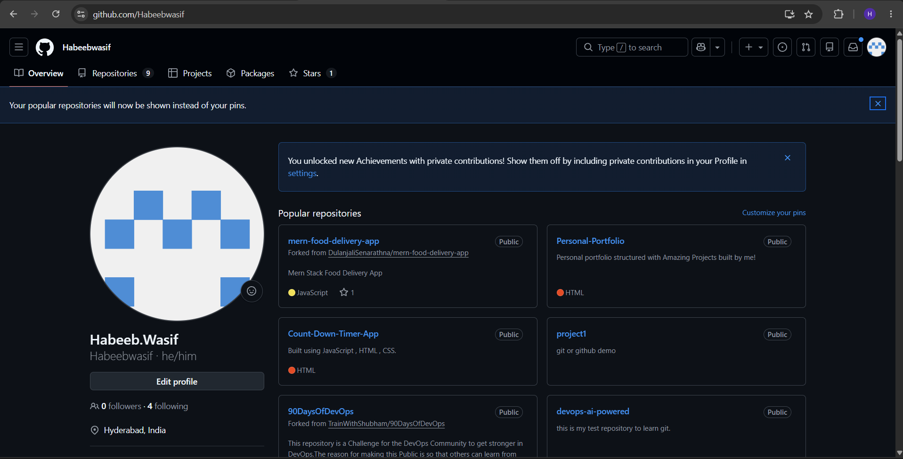
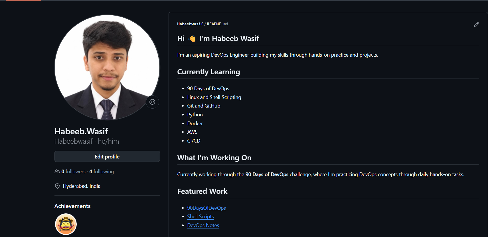
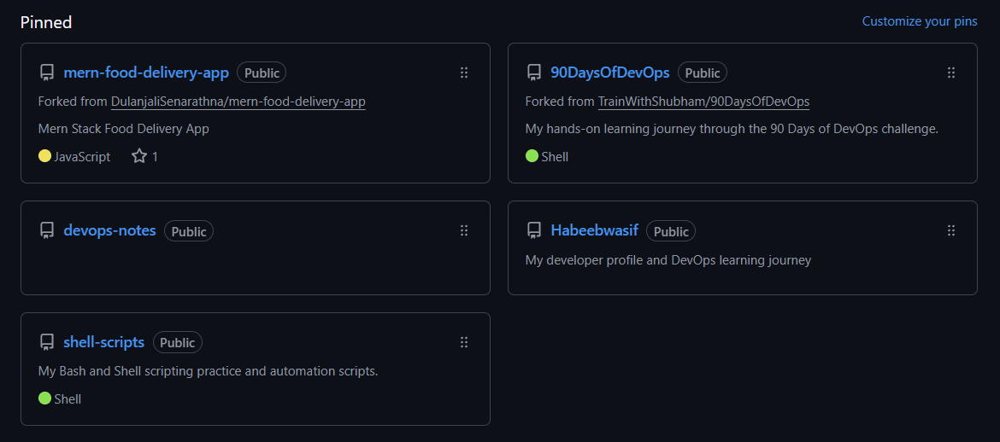

# Day 27 – GitHub Profile Makeover: Build Your Developer Identity

## Task 1: Audit Your Current GitHub Profile
Before making changes, assess where you stand:
1. Visit your own GitHub profile as if you were a stranger — what impression does it give?
2. Answer in your notes:

   ```bash
   - Is your profile picture professional?
    - **Yes**
   
   - Is your bio filled in? Does it say what you do?
    - **Yes**
   
   - Are your pinned repos relevant, or are they random forks?
   - **Relevant**
   
   - Do your repos have descriptions, or are they blank?
   - **Yes they have good meaningful descriptions**
   
   - Would a recruiter understand what you've been working on?
   - **Yes**
   ```
---

## Task 2: Create Your Profile README

* **Created**

---

## Task 3: Organize Your Repositories

1. **90 Days of DevOps** — 
    
    * [90 Days of DevOps Repository](https://github.com/Habeebwasif/90DaysOfDevOps)

2. **Shell Scripts** — a dedicated repo for all your shell scripting work

    * [Shell Scripts Repository](https://github.com/Habeebwasif/shell-scripts)

3. **DevOps Notes** — a repo for your learning notes, cheat sheets, and references

    * [DevOps Notes](https://github.com/Habeebwasif/devops-notes)

---

## Task 4: Pin Your Best Repos

* **Pinned my best 6**

---

## Task 6: Before & After

- Before


    
- After


  

  
