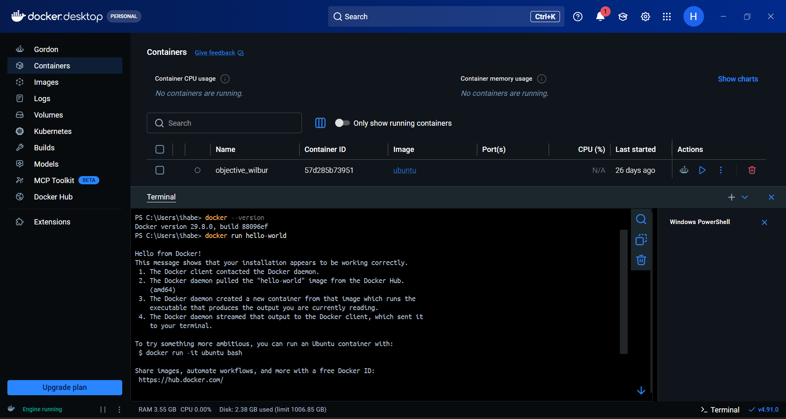
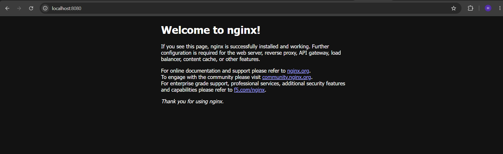
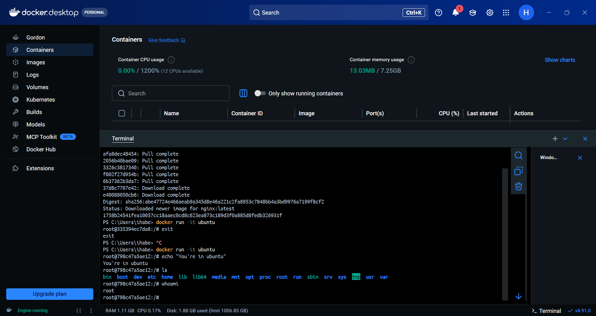
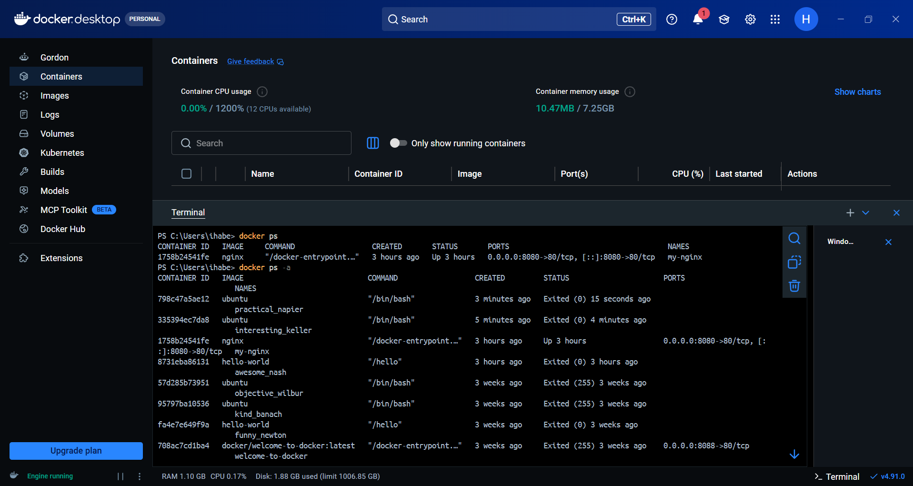
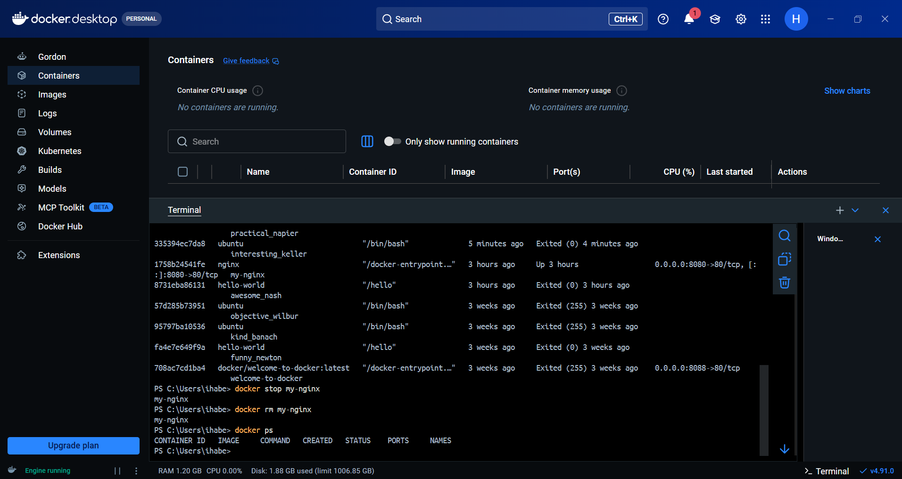
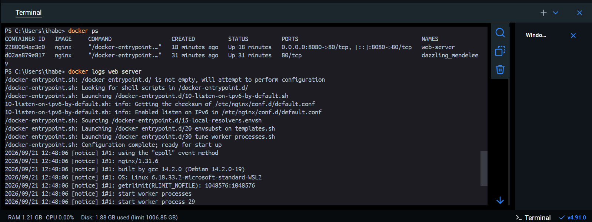
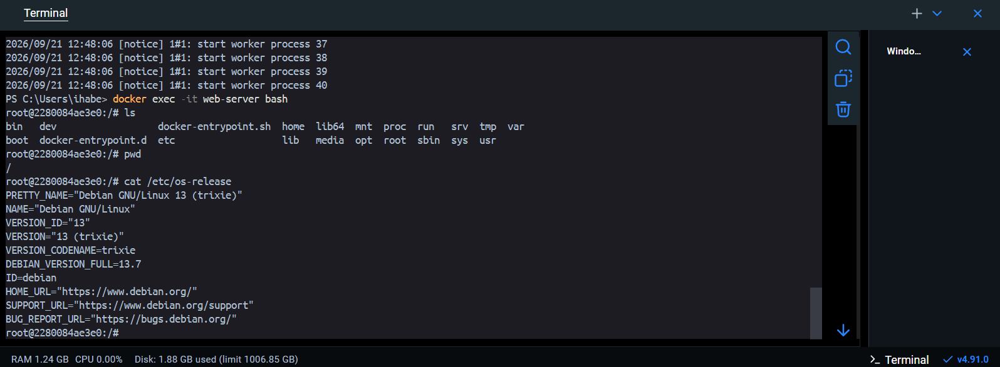

## Introduction to Docker

Task 1: What is Docker?
Research and write short notes on:

Q. What is a container and why do we need it?

```text

-> A Container is a lightweight, executable package of software that includes
   code, runtime, system tools, libraries, and configurations to run an application.

-> Containerization is creating a virtual environment which has all the
   things required for that particular app to work.

         "Write Once, Run Anywhere"

```
---

Q.Containers vs Virtual Machines — what's the real difference?

| feature | Containers |  Virtual Machines |
|---------| ---------- | ----------------- |
| What is virtualized | Operating system | Hardware |
| Key component | Container engine (Docker, containerd + runc) | Hypervisor (Hyper-V, VirtualBox) | 
| Startup time | Milliseconds to seconds | Seconds to minutes |
| Size | MBs | GBs |
| Portability | Lightweight images (run the same anywhere the engine runs) | Heavier images, harder to move | 

---

Q.What is the Docker architecture? (daemon, client, images, containers, registry)

```text

-> Docker Daemon - It manages objects such as Images, containers, networks and volumes. Also listens API requests.

-> Client (The docker CLI Docker Desktop) - It sends the commands to the daemon.

-> Images - A Docker image is a read-only template used to create containers.

-> Containers - Running instances of an image.

-> Registry - A registry stores Docker images EX: Docker Hub.

```
## Task 2: Install Docker

1. Install Docker on your machine (or use a cloud instance)

```text
- Installed Docker on my machine (Docker Desktop)
```

2. Verify the installation

```text
`docker --version`
```

3. Run the `hello-world` container

```text
`docker run hello-world`
```

4. Read the output carefully — it explains what just happened



---

## Task 3: Run Real Containers
1. Run an **Nginx** container and access it in your browser

```text
`docker run -d -p 8080:80 --name my-nginx nginx`
```


2. Run an **Ubuntu** container in interactive mode — explore it like a mini Linux machine

```text
`docker run -it ubuntu`
we can explore: echo, ls, whoami and many commands.
```


3. List all running containers

```text
`docker ps`
```
4. List all containers (including stopped ones)

```text
`docker ps -a`
```


5. Stop and remove a container

```text
`docker stop my-nginx`
`docker rm my-nginx`
```

---

## Task 4: Explore
1. Run a container in **detached mode** — what's different?

```text
In detached mode:

`docker run -d nginx`
The `-d` flag starts the container in the background. It displays only container id.

In foreground:

`docker run -it nginx
The Container's stdout/stderr stream to our screen. To stop, ctrl+c.
```

2. Give a container a custom **name**

```text
`docker run -d -p 8080:80 --name web-server nginx
```

3. Map a **port** from the container to your host

```text
`docker run -d -p 8080:80 --name web-server nginx`
```

4. Check **logs** of a running container

```bash
`docker logs nginx
```



5. Run a command **inside** a running container

```bash
`docker exec -it web-server bash`

`we can explore: ls, pwd, cat /etc/os-release
```



## Docker command cheat sheet for my own use

| Command | What it does |
|---------|--------------|
| `docker --version` | Shows the installed Docker version (verifies the installation) |
| `docker run hello-world` | Runs a test container that confirms Docker works end to end |
| `docker run nginx` | Runs Nginx in the foreground; output streams to the terminal, Ctrl+C stops it |
| `docker run -d nginx` | Runs Nginx in the background (detached) and prints only the container ID |
| `docker run -d -p 8080:80 --name my-nginx nginx` | Runs Nginx in the background, maps host port 8080 to container port 80, and names it `my-nginx` |
| `docker run -d -p 8080:80 --name web-server nginx` | Same as above with the name `web-server` |
| `docker run -it ubuntu` | Starts an Ubuntu container with an interactive shell (`-i` keeps stdin open, `-t` gives a terminal) |
| `docker ps` | Lists running containers |
| `docker ps -a` | Lists all containers, including stopped ones |
| `docker logs web-server` | Shows the output (logs) of a container |
| `docker exec -it web-server bash` | Opens a shell inside a running container |
| `docker stop my-nginx` | Stops a running container |
| `docker rm my-nginx` | Removes a stopped container |

