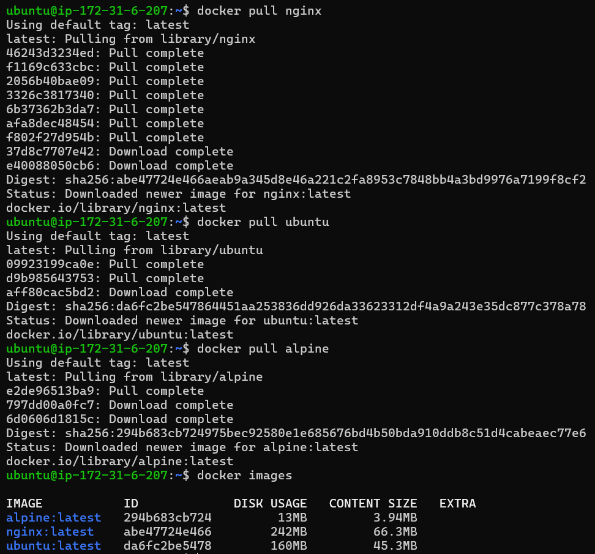
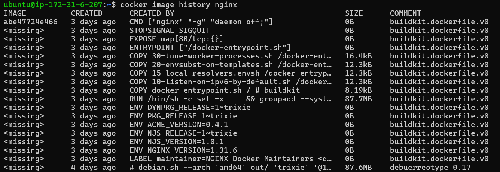
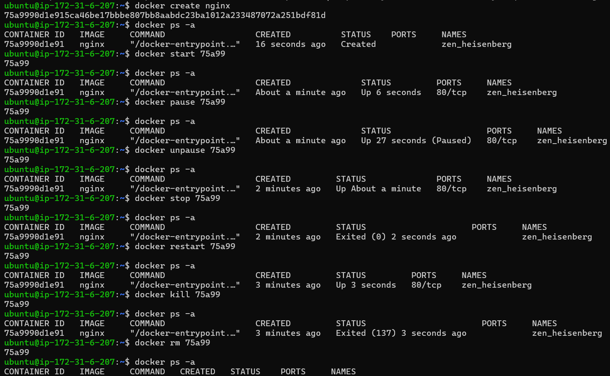
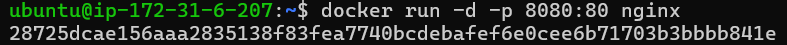
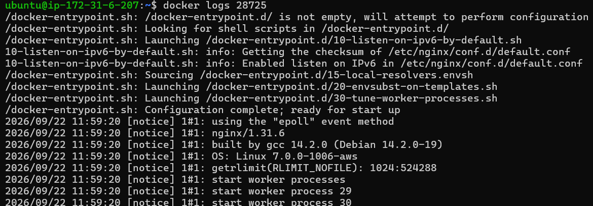
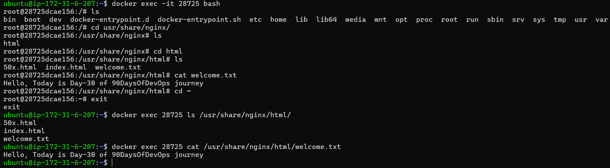
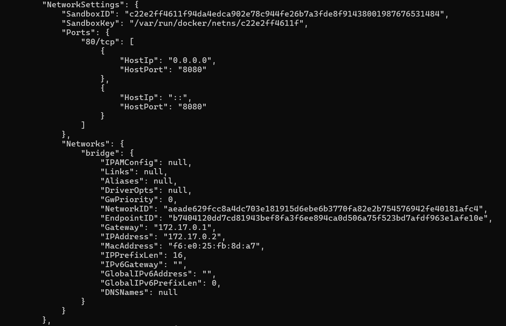
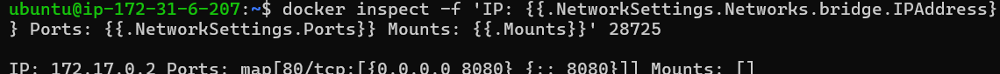
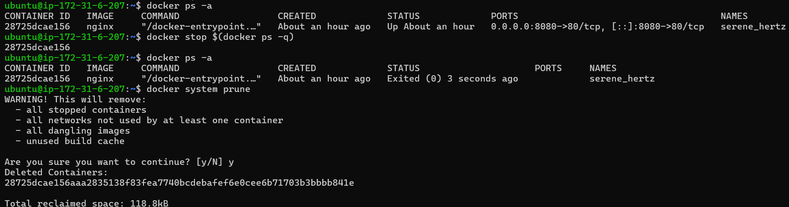
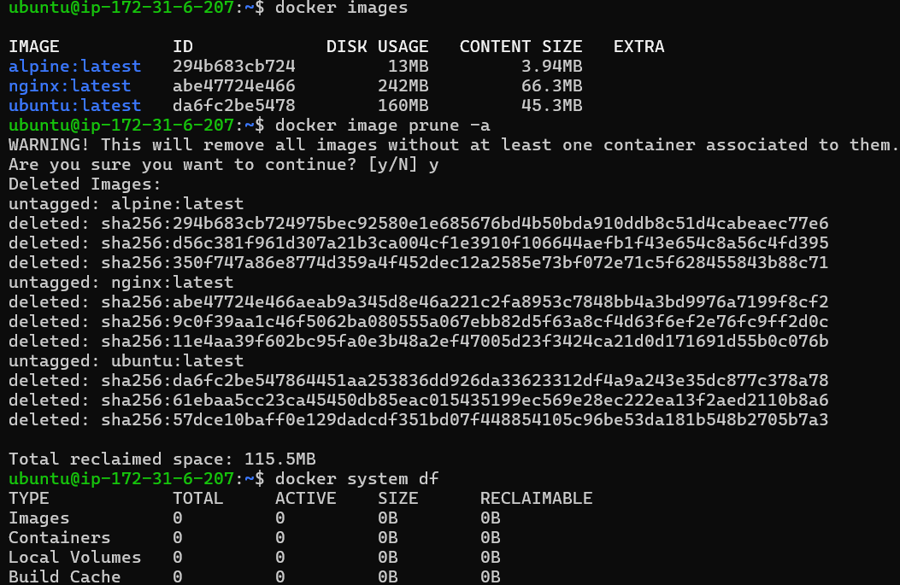

# Day 30 – Docker Images & Container Lifecycle

## Task 1: Docker Images
1. Pull the `nginx`, `ubuntu`, and `alpine` images from Docker Hub

```text
`docker pull <image-name>`
```

2. List all images on your machine — note the sizes



3. Compare `ubuntu` vs `alpine` — why is one much smaller?

```text

`Alpine` is a smaller image compared to ubuntu because it contains lightweight C library (musl) with
only core essential binaries (via BusyBox) whereas, ubuntu includes glibc plus many built‑in tools, libraries,
and GNU utilities which makes it heavier.

```

4. Inspect an image — what information can you see?

```text
`docker image inspect alpine`
```
```bash
-> Image ID — sha256:294b683cb724975bec92580e1e685676bd4b50bda910ddb8c51d4cabeaec77e6

-> Image configuration — includes Env, Cmd, WorkingDir

-> Environment variables — PATH=/usr/local/sbin:/usr/local/bin:/usr/sbin:/usr/bin:/sbin:/bin

-> Architecture — amd64

-> Operating system — linux

-> Entrypoint — not set beacause Alpine has no entrypoint defined

-> Default command — /bin/sh

-> Exposed ports — none (Alpine exposes no ports by default)

-> Layers — 1 layer: sha256:74d97c428c51a828f9051a7a40a53ff1fc99e54fc30323ce36760701b0b7f711

-> Image metadata — LastTagTime: 2026-09-22T09:45:36.885150883Z

-> Image creation information — Created: 2026-09-17T20:37:20.889221879Z

```
---

5. Remove an image you no longer need

```bash
Command: `docker rm <image-name>`
-> only to be removed when no longer in use or need.
```
---

## Task 2: Image Layers
1. Run `docker image history nginx` — what do you see?
2. Each line is a **layer**. Note how some layers show sizes and some show 0B



3. Write in your notes: What are layers and why does Docker use them?
```
┌───────────────────────────────────────┐
│     Writable Layer (Runtime Apps)     │ <-- Container Layer (Read/Write)
├───────────────────────────────────────┤
│     Layer 3: COPY . /app              │ <-- Image Layer (Read-Only)
├───────────────────────────────────────┤
│     Layer 2: RUN apt-get install python│ <-- Image Layer (Read-Only)
├───────────────────────────────────────┤
│     Layer 1: FROM ubuntu:latest       │ <-- Base Layer (Read-Only)
└───────────────────────────────────────┘
```
Docker uses layers for three core reasons:

```bash
`Reusability across images`:
-> If we build two Python apps, both reuse the same Python base layers which helps save storage, bandwidth, and build time.

`Incremental builds`:
-> When we change our Dockerfile, Docker rebuilds only the affected layer and those above it.
Layers before the change are cached, making rebuilds fast.

`Efficient container execution`:
-> When we run a container, Docker stacks all image layers read-only,
then adds a writable layer on top (the "container layer").
-> This lets multiple containers from the same image run independently without duplicating the base data.
```

## Task 3: Container Lifecycle
Practice the full lifecycle on one container:
1. **Create** a container (without starting it)
2. **Start** the container
3. **Pause** it and check status
4. **Unpause** it
5. **Stop** it
6. **Restart** it
7. **Kill** it
8. **Remove** it

Check `docker ps -a` after each step — observe the state changes.



---

## Task 4: Working with Running Containers
1. Run an Nginx container in detached mode

```text
`docker run -d -p 8080:80 nginx`
```


2. View its **logs**

```text
`docker logs <container-id>`
```


    
3. View **real-time logs** (follow mode)

```text
`docker logs -f <container-id>`
```


4. **Exec** into the container and look around the filesystem

```text
`docker exec -it 28725 bash`
```

6. Run a single command inside the container without entering it

```text
`docker exec 28725 ls /usr/share/nginx/html/`

`docker exec 28725 cat /usr/share/nginx/html/welcome.txt`
```



6. **Inspect** the container — find its IP address, port mappings, and mounts

```text
`docker inspect <container-id>`
```





---

### Task 5: Cleanup
1. Stop all running containers in one command

```text
`docker stop $(docker ps -q)`
```

2. Remove all stopped containers in one command

```text
`docker system prune`
```


3. Remove unused images

```text
`docker image prune`
-> removes only dangling images

`docker image prune -a`
-> removes all unused images

```
4. Check how much disk space Docker is using

```text
`docker system df`
```

