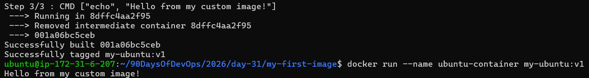
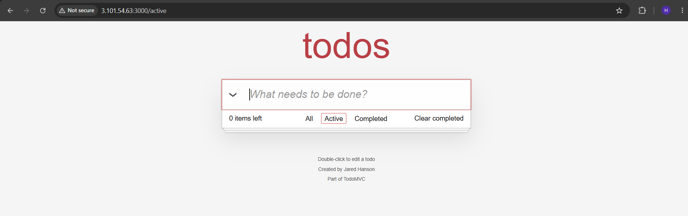
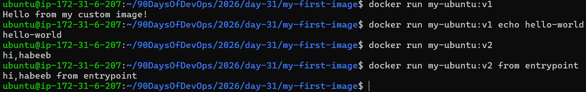
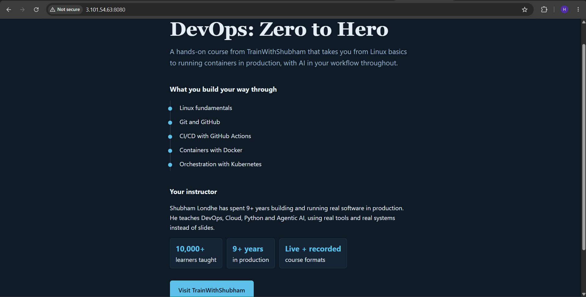
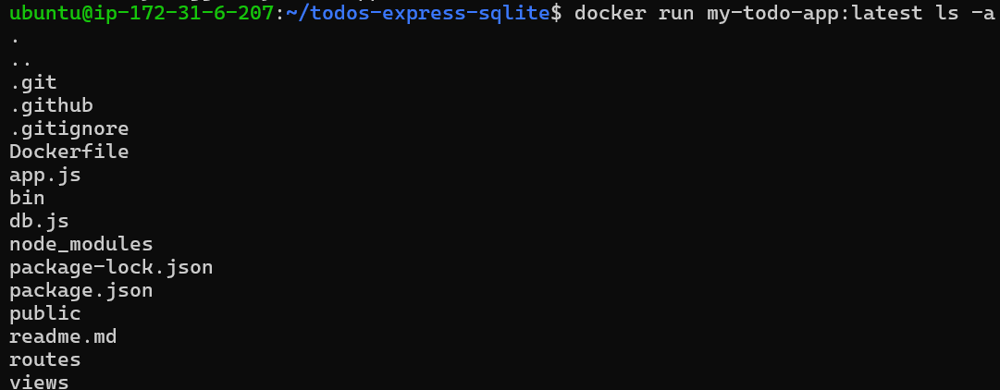
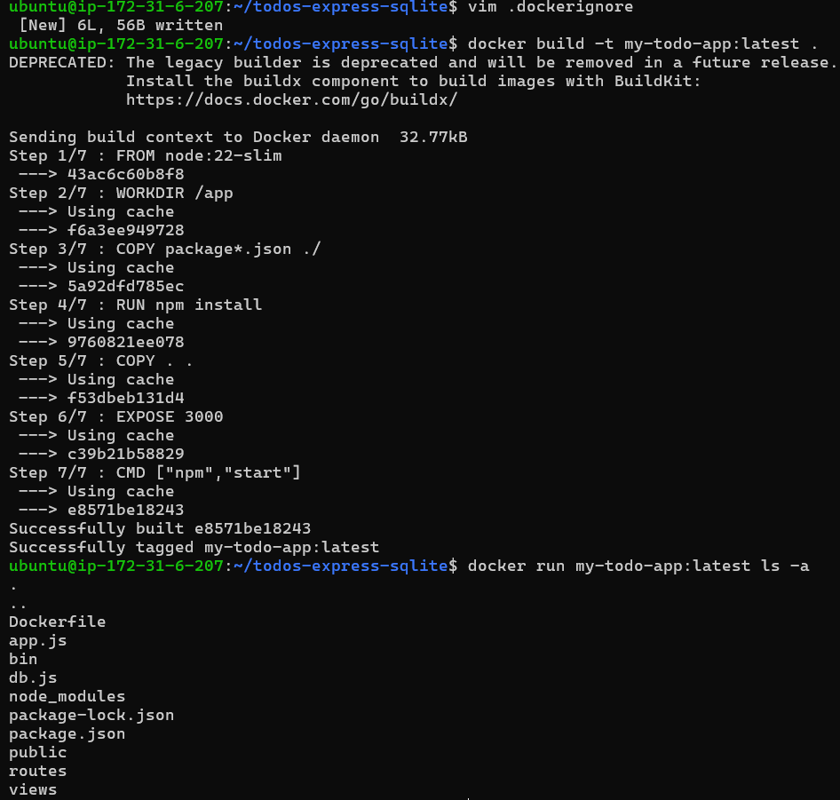

# Day 31 – Dockerfile: Build Your Own Images

## Task 1: Your First Dockerfile
1. Create a folder called `my-first-image`
2. Inside it, create a `Dockerfile` that:
   - Uses `ubuntu` as the base image
   - Installs `curl`
   - Sets a default command to print `"Hello from my custom image!"`
3. Build the image and tag it `my-ubuntu:v1`
4. Run a container from your image

**Verify:** The message prints on `docker run`

[View my Docker file](my-first-image/Dockerfile)


    
---

## Task 2: Dockerfile Instructions
Create a new Dockerfile that uses **all** of these instructions:
- `FROM` — base image
- `RUN` — execute commands during build
- `COPY` — copy files from host to image
- `WORKDIR` — set working directory
- `EXPOSE` — document the port
- `CMD` — default command

Build and run it. Understand what each line does.
  
[View my Docker file](first-todo-app/Dockerfile)


    
---

## Task 3: CMD vs ENTRYPOINT
1. Create an image with `CMD ["echo", "hello"]` — run it, then run it with a custom command. What happens?
2. Create an image with `ENTRYPOINT ["echo"]` — run it, then run it with additional arguments. What happens?
3. Write in your notes: When would you use CMD vs ENTRYPOINT?
```text
I'd use CMD for a default command that can be replaced when I run the container
(like npm start for my todo app) and ENTRYPOINT when the container should always run one fixed program,
with whatever I type after the image name passed to it as arguments.
```


---

## Task 4: Build a Simple Web App Image
1. Create a small static HTML file (`index.html`) with any content
2. Write a Dockerfile that:
   - Uses `nginx:alpine` as base
   - Copies your `index.html` to the Nginx web directory
3. Build and tag it `my-website:v1`
4. Run it with port mapping and access it in your browser

[View my Docker file](nginx-web-page/Dockerfile)



---
    
## Task 5: .dockerignore
1. Create a `.dockerignore` file in one of your project folders
2. Add entries for: `node_modules`, `.git`, `*.md`, `.env`
3. Build the image — verify that ignored files are not included
    

    

    
---

## Task 6: Build Optimization
1. Build an image, then change one line and rebuild — notice how Docker uses **cache**
2. Reorder your Dockerfile so that frequently changing lines come **last**
3. Write in your notes: Why does layer order matter for build speed?

Why:
```text
When Docker builds an image, it checks each instruction sequentially. If an instruction matches
the cached version exactly, Docker reuses that layer.

But if anything changes in a file, a command string—that layer's cache is invalidated.
All subsequent layers are also invalidated, even if they haven't changed.
```
Example:
```bash
FROM node
WORKDIR /app
COPY . .                 # Copy all files
RUN npm install          # Install dependencies
RUN npm build
```
Explaination:
```text
Problem: When you edit any source file, the COPY . . layer invalidates, forcing npm install
to rerun even though package.json hasn't changed.

Optimized order: dependencies first, source code last.
```
Optimized Example:
```bash
FROM node
WORKDIR /app
COPY package.json yarn.lock .    # Copy only dependency files
RUN npm install                  # Cache reused if dependencies unchanged
COPY . .                         # Copy source code (changes frequently)
RUN npm build
```
Explaination:
```text
Now changing source files only invalidates COPY . . and npm build. The expensive `npm install`
layer stays cached.
```

Key-Takeaway: Put expensive, infrequently-changed instructions early; put fast, frequently-changed instructions late.

---
