# Day 32 – Docker Volumes & Networking

## Task 1: The Problem
1. Run a Postgres or MySQL container
2. Create some data inside it (a table, a few rows — anything)
3. Stop and remove the container

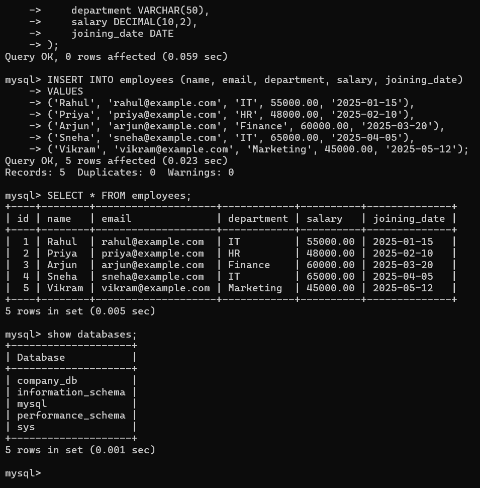

4. Run a new one — is your data still there?

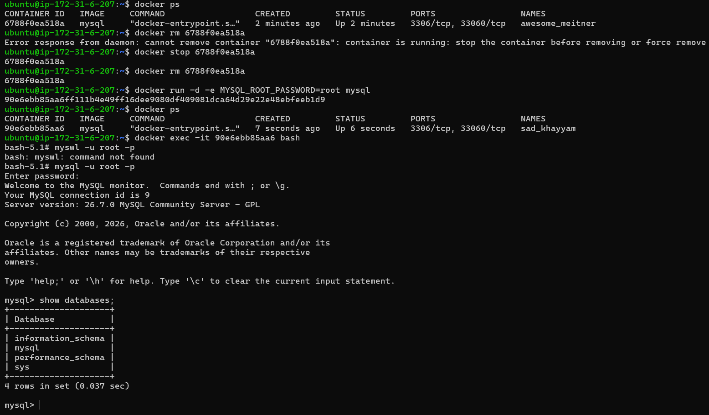

Explanation:

* No, when i removed the container, the database and all its data went away with it.
-> So when containers get removed, the writable layer containing my database is also deleted.


---

## Task 2: Named Volumes
1. Create a named volume
2. Run the same database container, but this time **attach the volume** to it
3. Add some data, stop and remove the container
4. Run a brand new container with the **same volume**
5. Is the data still there?

Before attaching volume:
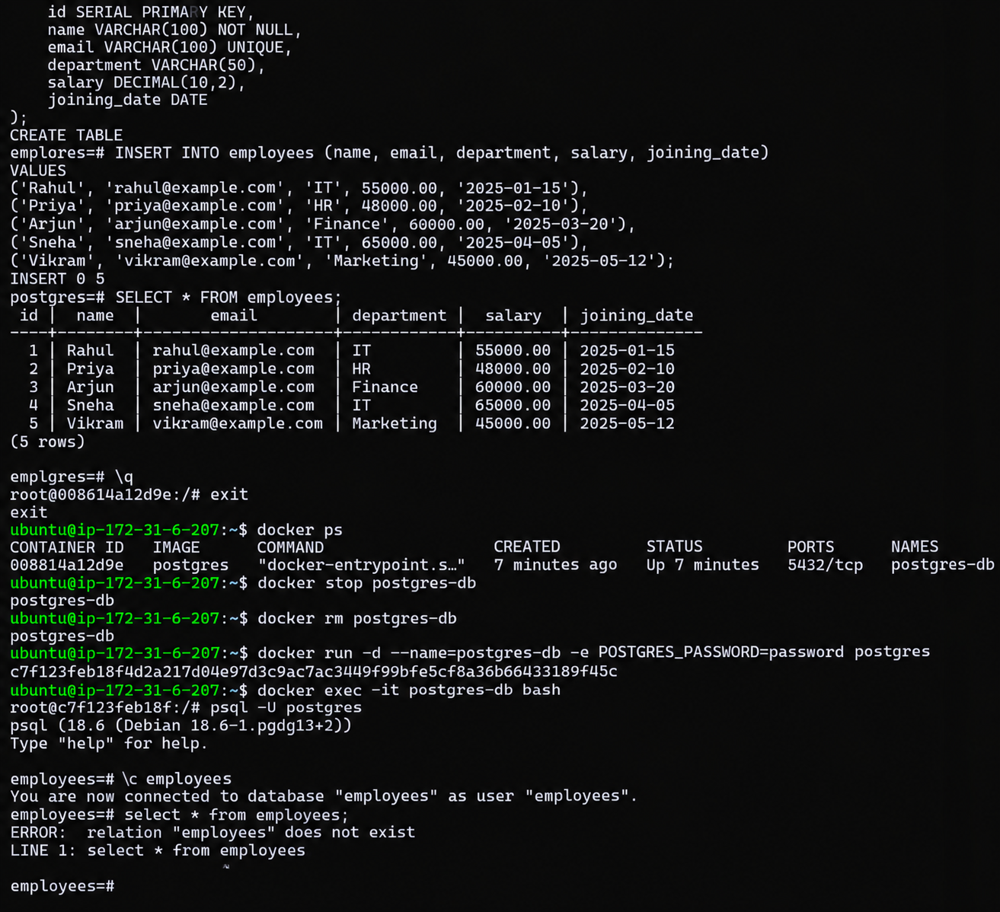

Attaching the volume:
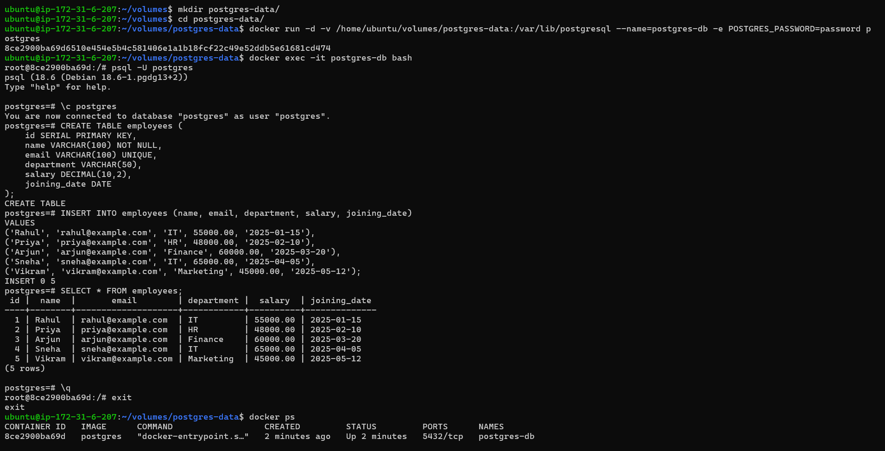

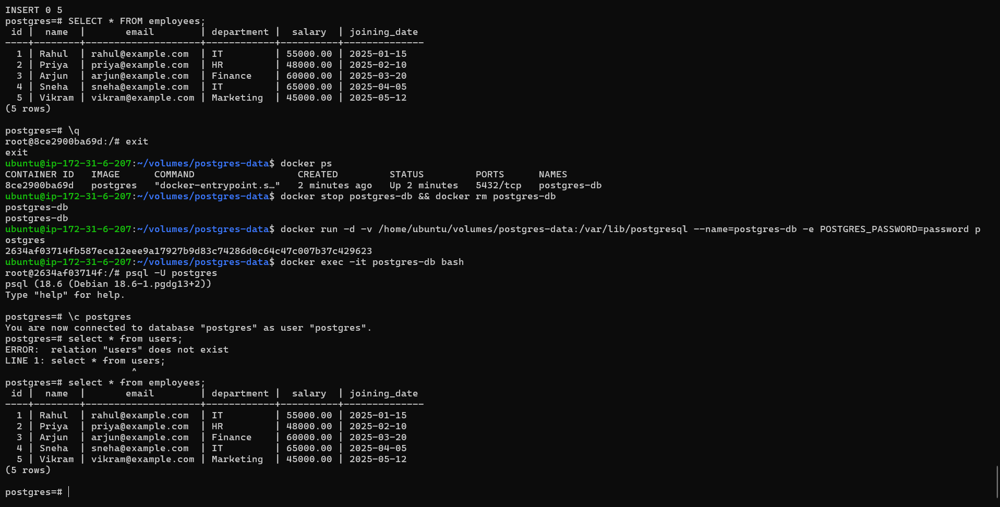

```bash
`docker volume ls` - lists all volumes on my system with their driver and name.

`docker volume inspect <volume-name>` - shows detailed info about a specific volume: driver,
mountpoint on host, labels, and which containers use it.
```
---

## Task 3: Bind Mounts
1. Create a folder on your host machine with an `index.html` file

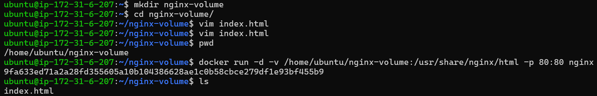

2. Run an Nginx container and **bind mount** your folder to the Nginx web directory

3. Access the page in your browser

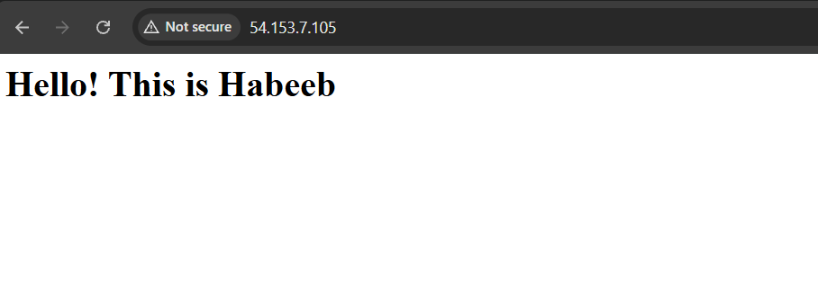

5. Edit the `index.html` on your host — refresh the browser

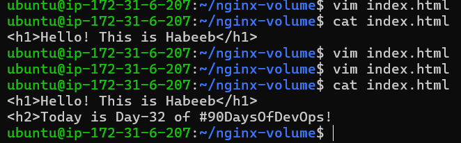

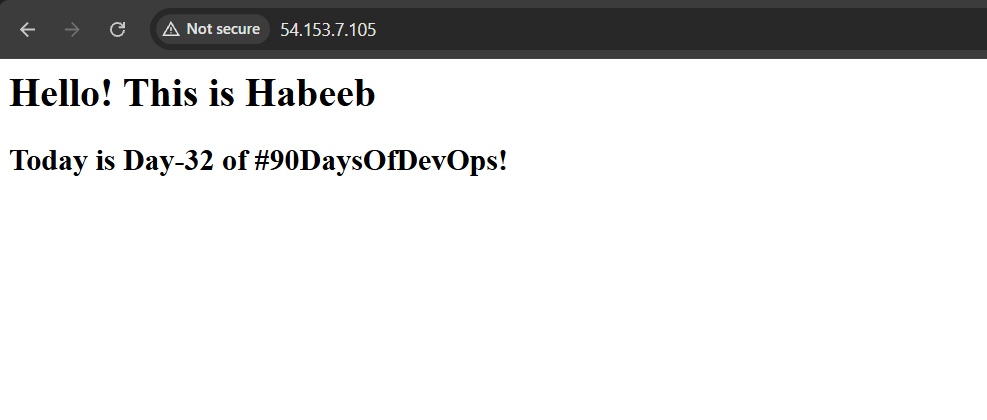

Write in your notes: What is the difference between a named volume and a bind mount?

```text
`Named Volume - Docker manages the storage location (usually /var/lib/docker/volumes/)
which is portable across machines, easier to backup.

`Bind Mount - We specify the exact host directory which gives us direct access to files on our
machine, better for development but tied to that specific host.
```
* Takeaway: Named volumes are more secure because Docker manages them in a controlled location
with proper permissions, isolating container data from the rest of your filesystem. 
---

## Task 4: Docker Networking Basics
1. List all Docker networks on your machine

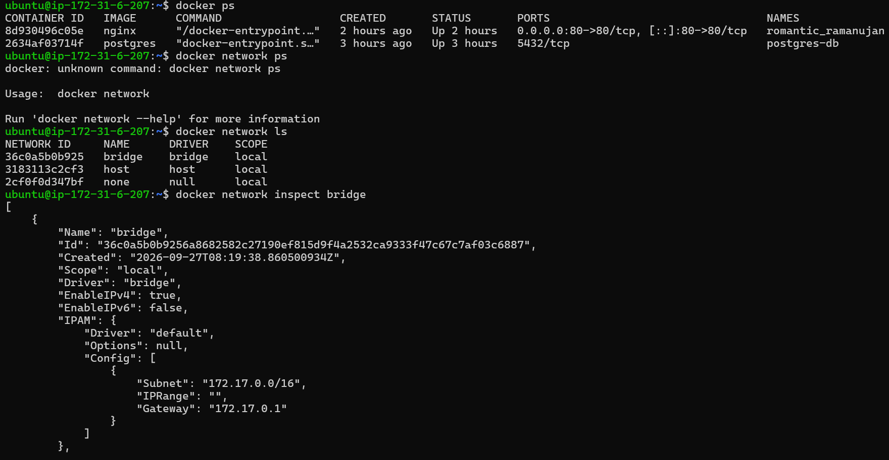

2. Inspect the default `bridge` network
3. Run two containers on the default bridge — can they ping each other by **name**?

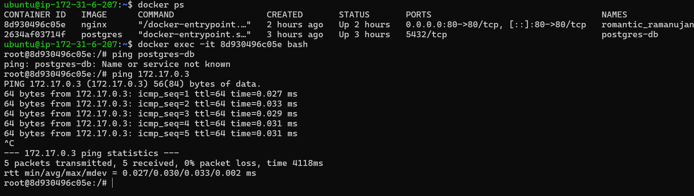

4. Run two containers on the default bridge — can they ping each other by **IP**?

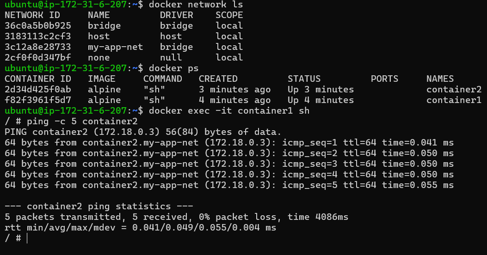

Answer:
```text
No, on default bridge, containers can't ping each other by **name** but can ping each other by **IP**.
```

---

## Task 5: Custom Networks
1. Create a custom bridge network called `my-app-net`
2. Run two containers on `my-app-net`
3. Can they ping each other by **name** now? **YES**

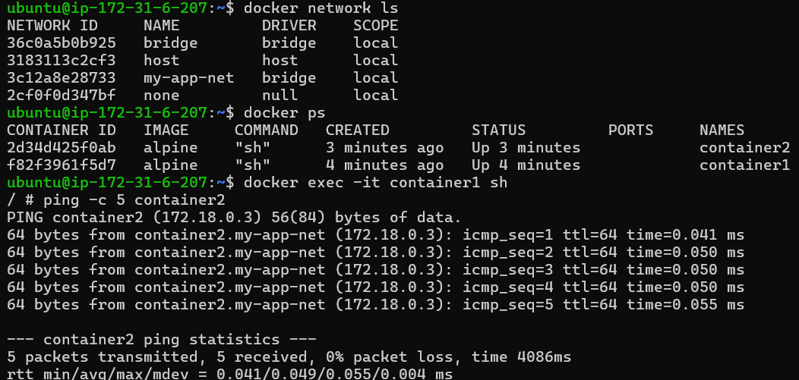

4. Write in your notes: Why does custom networking allow name-based communication but the default bridge doesn't?

Explaination:
```text
Custom networks have an embedded DNS server that resolves container names to IPs whereas,
the default bridge doesn't, so containers can only communicate by hardcoded IP addresses.
```

---

## Task 6: Put It Together
1. Create a custom network

```bash
docker network create test
```

2. Run a **database container** (MySQL/Postgres) on that network with a volume for data

```bash
docker volume create mysqldata

docker run -d \
  --name mysql-db \
  --network test \
  -e MYSQL_ROOT_PASSWORD=mysecretpassword \
  -v mysqldata:/var/lib/mysql \
  mysql

```
Where:
```text
`--network test` - attaches the container to the custom network.

`-v mysqldata:/var/lib/mysql` - mounts a named volume so the database's data
lives outside the container's writable layer and survives container removal/recreation.
```

3. Run an **app container** (use any image) on the same network

* Instead of a placeholder image, I containerized a real Node.js + Socket.io chat app from my own repo (node-chat-app)

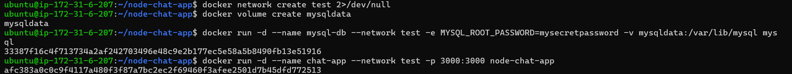

Running App container:
```bash
docker build -t node-chat-app .

docker run -d \
  --name chat-app \
  --network test \
  -p 3000:3000 \
  node-chat-app
```
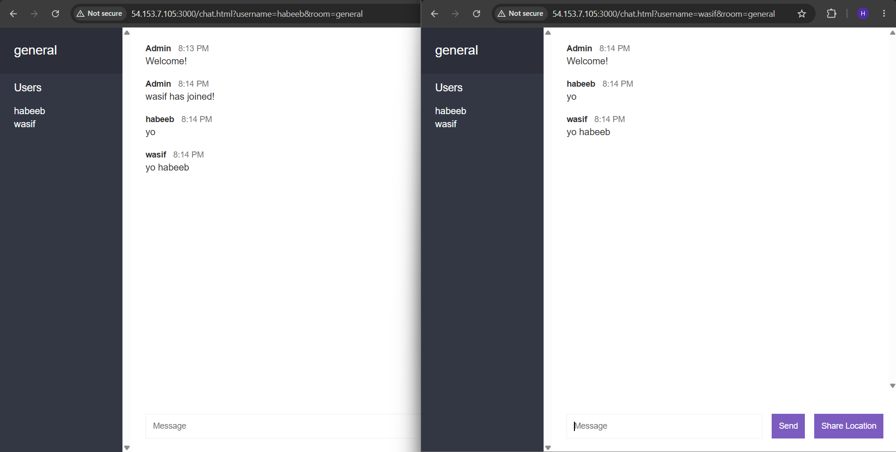

* Verified the app itself works by opening it in two browser tabs, joining the
same room, and confirming real-time messaging worked end-to-end.

4. Verify the app container can reach the database by container name

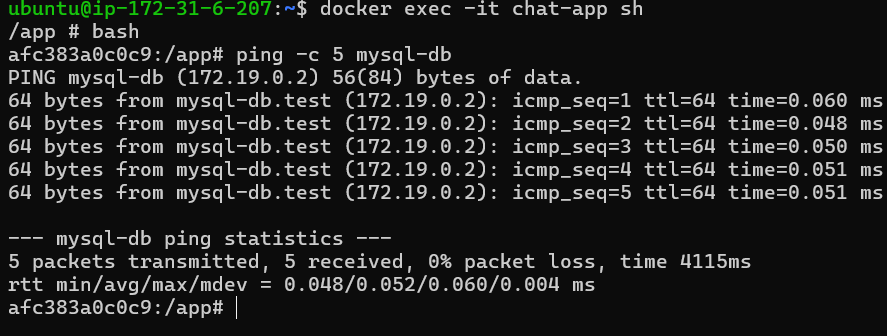

Output:

```text
Connected!
```

Explanation:

* Both confirm that `chat-app` can resolve and reach `mysql-db` purely by container name - no manual IP addressing needed,
because both containers share the custom `test` network, which runs Docker's embedded DNS.

Key takeaway:
```text
-> The chat app itself doesn't use MySQL internally (it stores messages/users in memory),
   so this step specifically validates the networking layer.

-> Thus, proving that any app placed on this network could reach the database by name if it needed to,
   which is the underlying mechanism that makes multi-container apps (e.g. via docker-compose) work.
```
