# Day 33 – Docker Compose: Multi-Container Basics

### Task 1: Install & Verify
1. Check if Docker Compose is available on your machine
2. Verify the version


```bash
Command:
`docker compose version`
```
---

### Task 2: Your First Compose File
1. Create a folder `compose-basics`
2. Write a `docker-compose.yml` that runs a single **Nginx** container with port mapping

[View my Docker-Compose-File](compose-basics/docker-compose.yml)

3. Start it with `docker compose up`

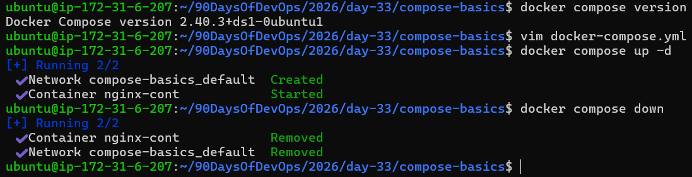

4. Access it in your browser

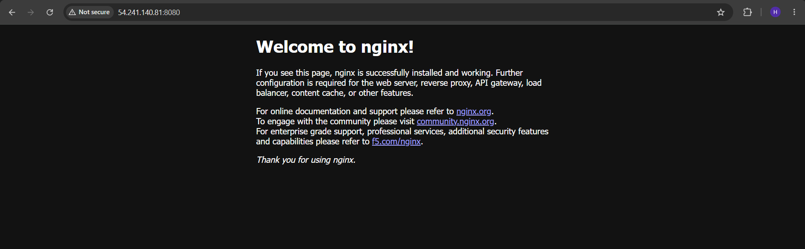

5. Stop it

```bash
Command:
`docker compose down`
```

---

### Task 3: Two-Container Setup
Write a `docker-compose.yml` that runs:
- A **WordPress** container
- A **MySQL** container

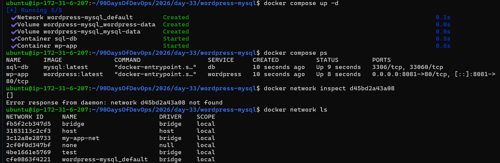

They should:
Be on the same network (Compose does this automatically)

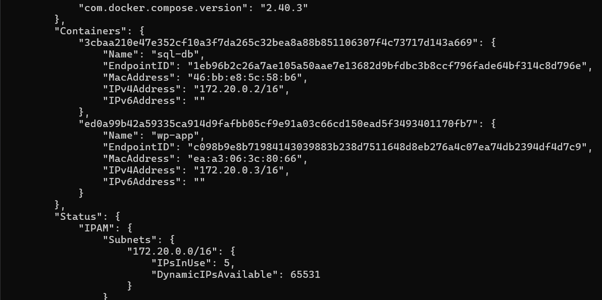

* Docker Compose automatically created the required network.

MySQL should have a named volume for data persistence

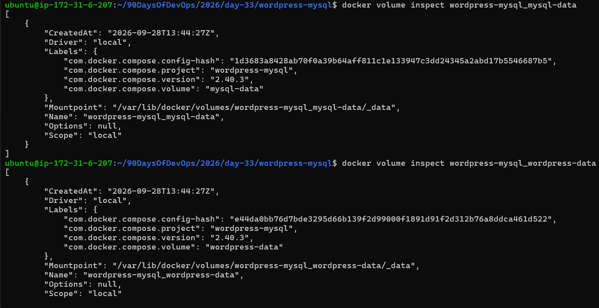

* Docker Compose automatically created the named volume for data persistence.

WordPress should connect to MySQL using the service name

Start it, access WordPress in your browser, and set it up.

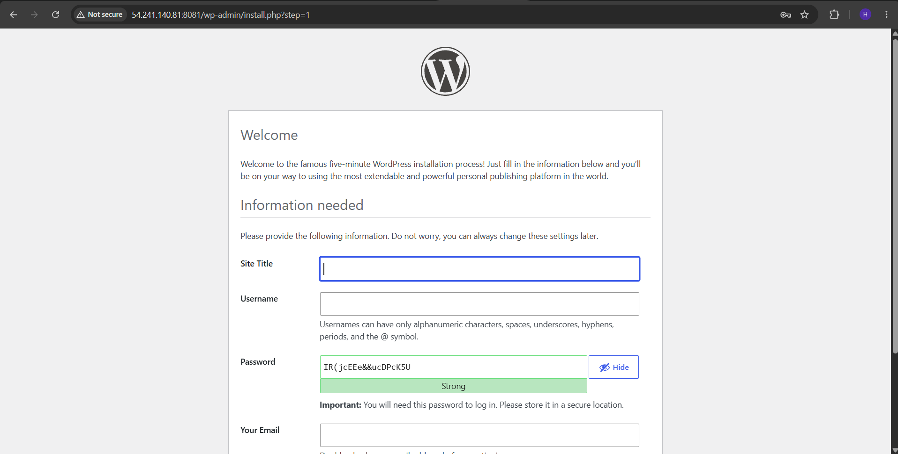

* Got Access of WordPress in my browser.

**Verify:** Stop and restart with `docker compose down` and `docker compose up` — is your WordPress data still there?

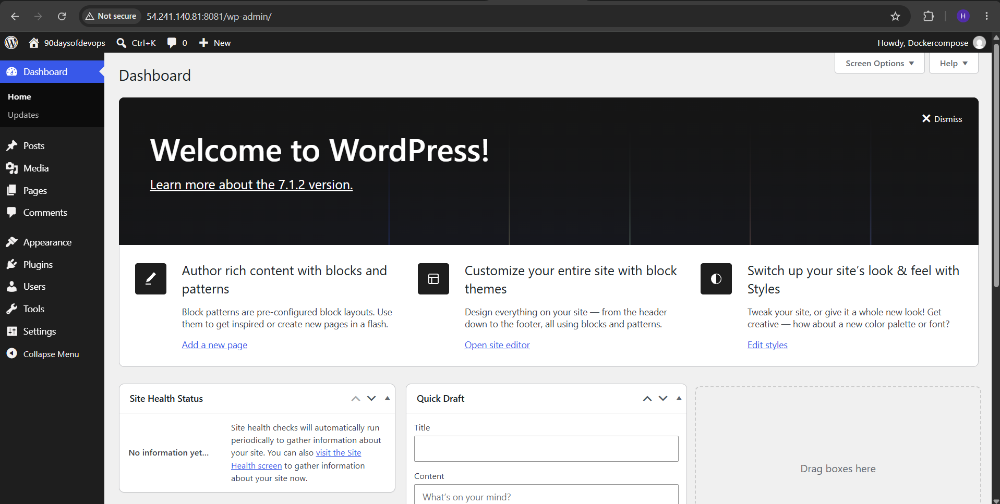

* Yes, the WordPress data is still there even after stopping and restarting the containers, which approves data persistence.

---

### Task 4: Compose Commands
Practice and document these:

## 1. Start services in detached mode

```bash
Command:
`docker compose up -d`
```

## 2. View running services

```bash
Command:
`docker compose ps`
```

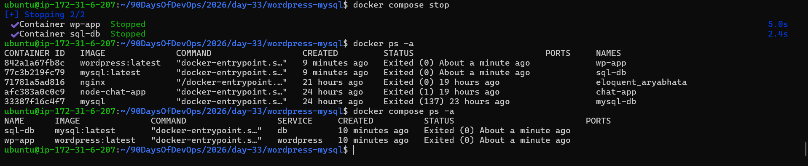

## 3. View logs of all services

```bash
Command:
`docker compose logs`
```

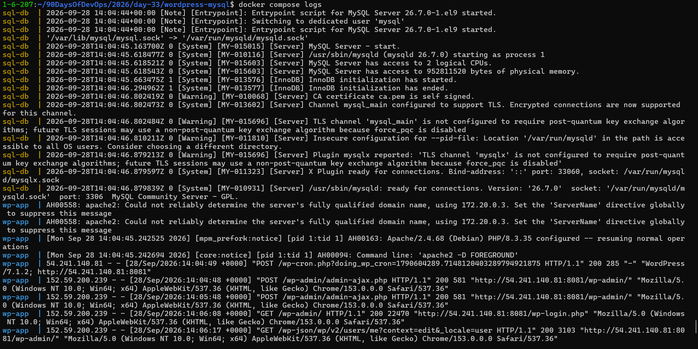

## 4. View logs of a specific service

```bash
Command:
`docker compose logs wordpress`
```

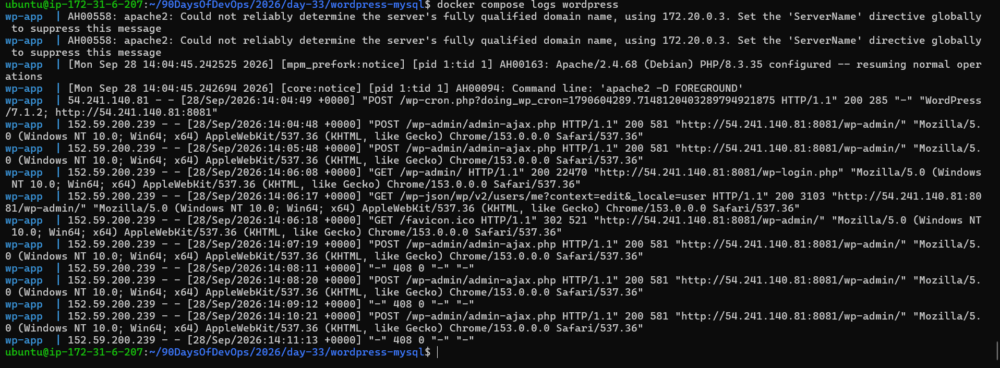

## 5. Stop services without removing

```bash
Command:
`docker compose stop`
```

## 6. Remove everything (containers, networks) (only if needed)

```bash
Command:
`docker compose down`
```

## 7. Rebuild images after a change

```bash
Command:
`docker compose up -d --build`
#only if we have `build:` section in dockerfile
```

---

### Task 5: Environment Variables
1. Added environment variables directly in my `docker-compose.yml`

[View my Docker-Compose-File](wordpress-mysql/docker-compose.yml)

2. Created a `.env` file and refered the variables from it in my compose file

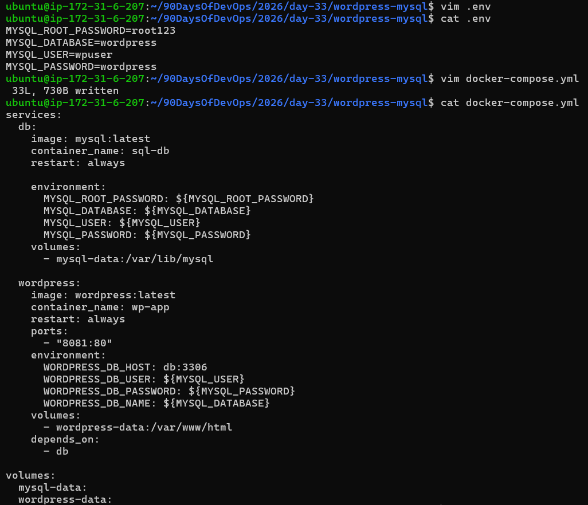

3. Verified the variables which are being picked up.

```bash
Command:
`docker compose config`
```

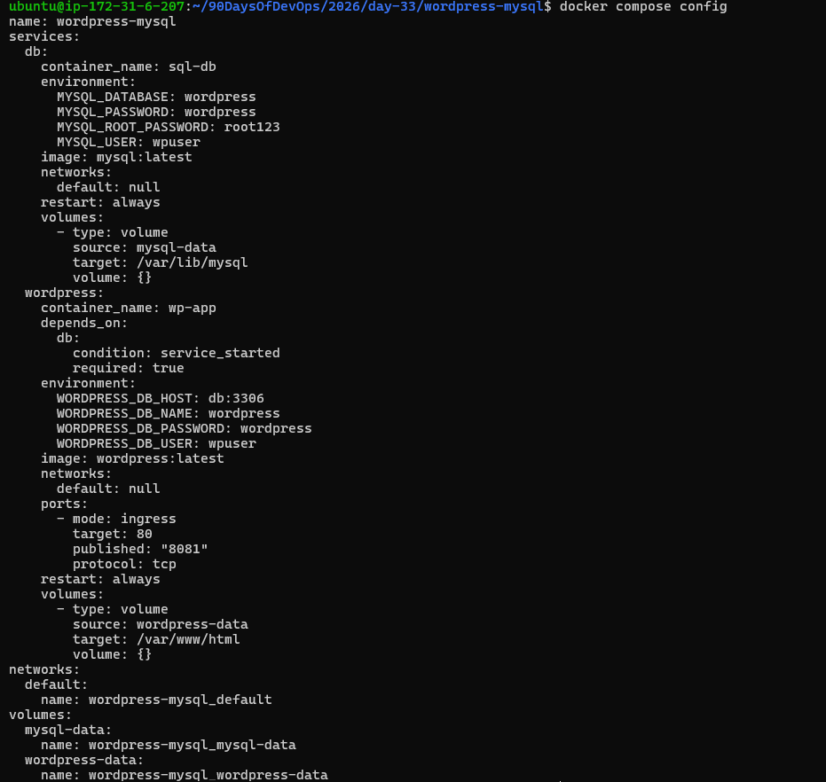

---

