# Day 34 – Docker Compose: Real-World Multi-Container Apps

### Task 1: Build Your Own App Stack
Create a `docker-compose.yml` for a 3-service stack:
- A **web app** (use Python Flask, Node.js, or any language you know)
- A **database** (Postgres or MySQL)
- A **cache** (Redis)

Write a simple Dockerfile for the web app. The app doesn't need to be complex — even a "Hello World" that connects to the database is enough.

[View my Dockerfile](stackpulse-app/Dockerfile)

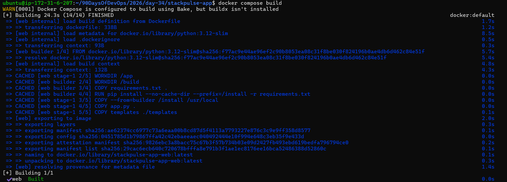


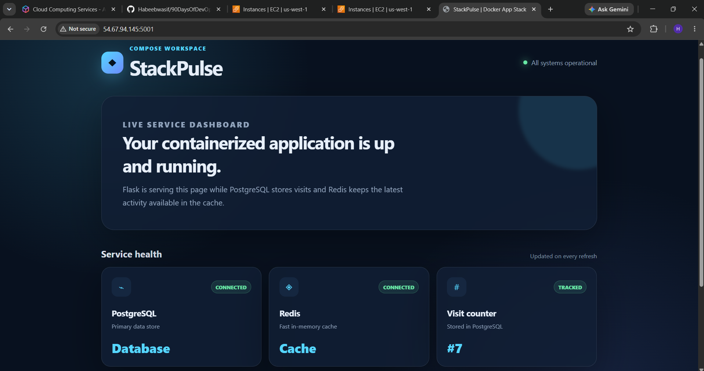


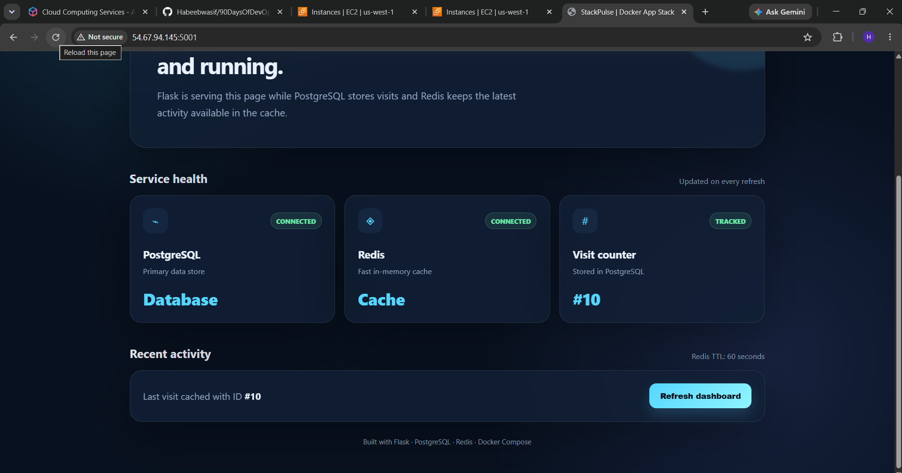
---

### Task 2: depends_on & Healthchecks
1. Add `depends_on` to your compose file so the app starts **after** the database
2. Add a **healthcheck** on the database service
3. Use `depends_on` with `condition: service_healthy` so the app waits for the database to be truly ready, not just started

[View my Docker-compose](stackpulse-app/docker-compose.yml)

**Test:** Bring everything down and up — does the app wait for the DB?

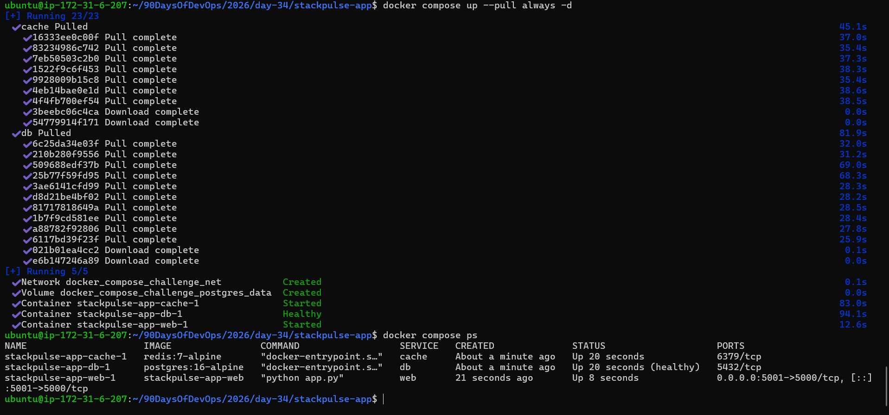

Explanation:
```text
Yes. After docker compose down and up, db started first and web only started after db passed
its healthcheck ((healthy) in docker compose ps).
-> depends_on alone only waits for the container to start.
-> With condition: service_healthy, it waits until Postgres actually accepts connections.
```
---

### Task 3: Restart Policies
1. Add `restart: always` to your database service
2. Manually kill the database container — does it come back?

```bash
docker kill stackpulse-app-db-1
```

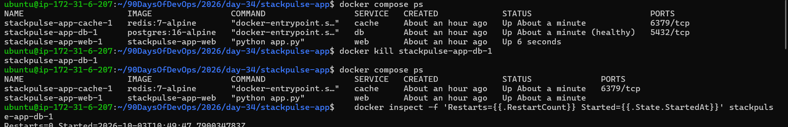

* With `restart: always:`

```text
-> I ran `docker kill` on the db container with restart: always.

-> It did not restart (RestartCount=0, container stayed exited).

-> Docker's documentation says that when a container is manually stopped, its restart policy
   is ignored until the daemon restarts or the container is started manually.

-> A container killed by Docker's own CLI is treated this way, so the policy only triggers on unexpected exits such
   as a crash.
```

3. Try `restart: on-failure` — how is it different?

* With restart: on-failure:

* It did not restart after docker kill

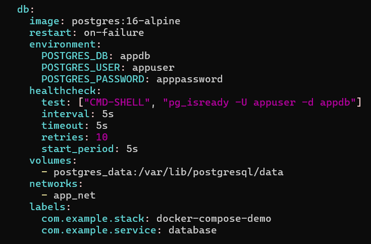


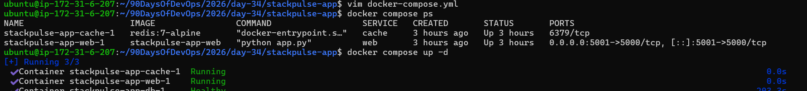


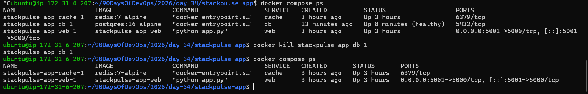

Explantion:
```
Why?

-> Docker treats a kill through its own CLI as a manual stop. 

-> on-failure, only restarts on a crash (non-zero exit) that the container causes itself.
```
4. Write in your notes: When would you use each restart policy?

```text
I woould use:
`restart: always` - for long-running services that must stay up, such as databases, web servers, or workers that should run forever. 
It restarts the container whatever the exit code (including a clean exit with code 0) and after a Docker daemon restart,
but not after a manual stop such as docker kill or docker stop.

`restart: on-failure` - for jobs or services that should be retried only when they exit with an error (non-zero exit code). 
It avoids restarting after a normal exit with code 0, and can be capped (for example on-failure:5) to prevent endless crash loops.
```
---

### Task 4: Custom Dockerfiles in Compose
1. Instead of using a pre-built image for your app, use `build:` in your compose file to build from a Dockerfile
2. Make a code change in your app
3. Rebuild and restart with one command

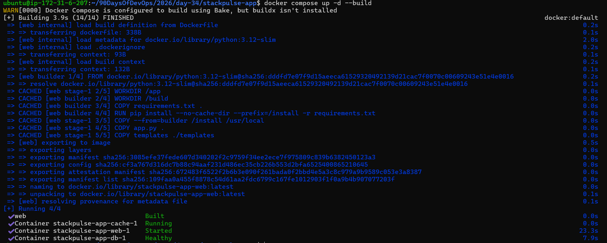
---


### Task 5: Named Networks & Volumes
1. Define **explicit networks** in your compose file instead of relying on the default
2. Define **named volumes** for database data
3. Add **labels** to your services for better organization

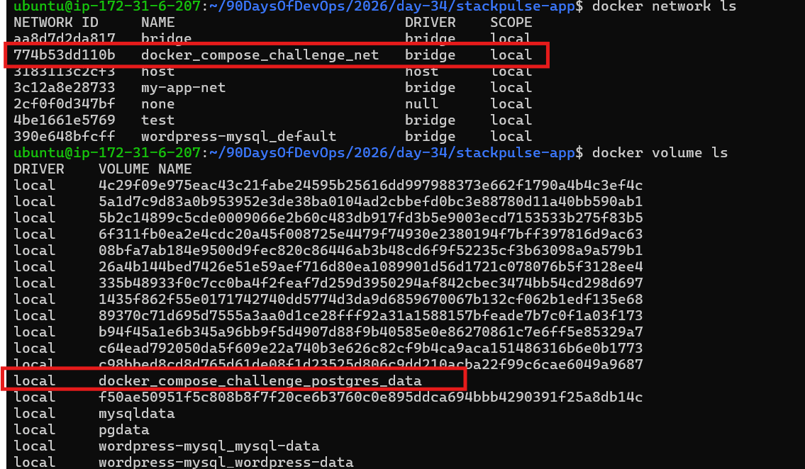

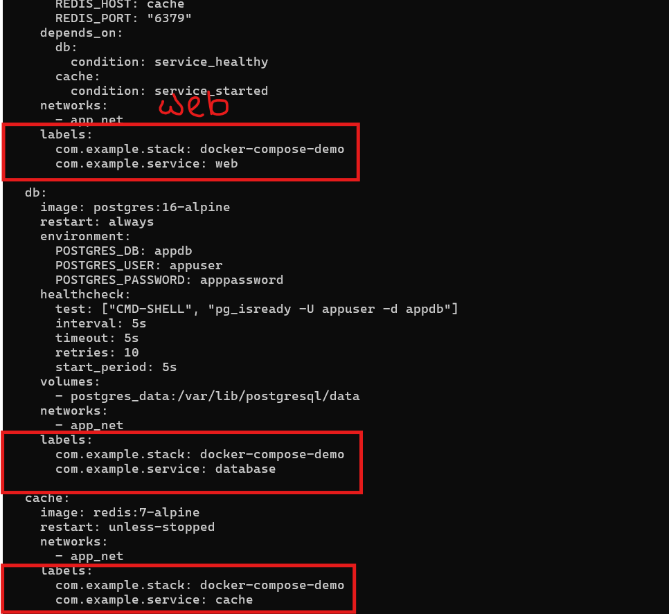
---

### Task 6: Scaling (Bonus)
1. Try scaling your web app to 3 replicas using `docker compose up --scale`
2. What happens? What breaks?

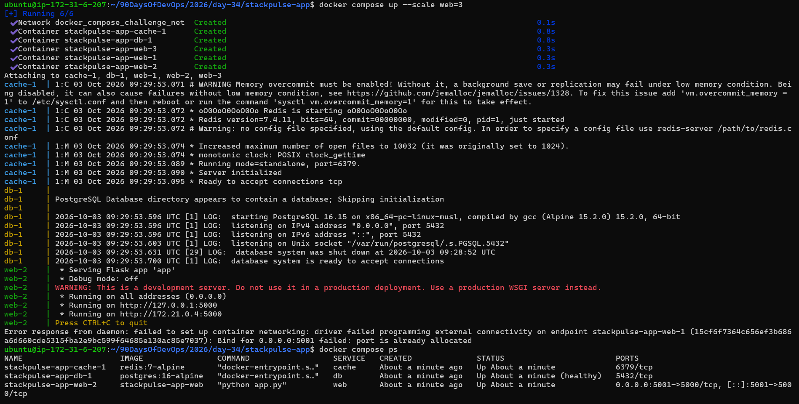

```text
-> docker compose up --scale web=3 created three containers. web-2 took host port 5001.

-> web-1 failed with Bind for 0.0.0.0:5001 failed: port is already allocated.

-> web-3 was created but never started, so only web-2 ran.
```
3. Write in your notes: Why doesn't simple scaling work with port mapping?

```text
-> "5001:5000" binds one host port to one container. A host port can be held by only one
container at a time, so replicas can't all publish on 5001.
```
To scale we need:

Fixes: a port range ("5001-5003:5000"), or, better, no host port on web and a
reverse proxy or load balancer (nginx, Traefik) that publishes one port and spreads traffic across replicas.
```
---
