# Day 35 – Multi-Stage Builds & Docker Hub

## Task 1: The Problem with Large Images
1. Write a simple Go, Java, or Node.js app (even a "Hello World" is fine)
2. Create a Dockerfile that builds and runs it in a **single stage**
3. Build the image and check its **size**

Wrote a Simple Node.js App:

[View my Dockerfile](Dockerfile)

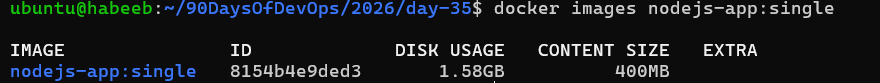

Working:

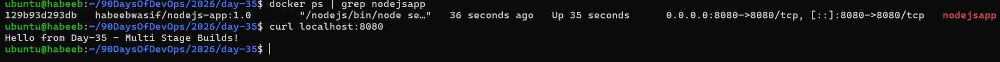

---

## Task 2: Multi-Stage Build
1. Rewrite the Dockerfile using **multi-stage build**:
   - Stage 1: Build the app (install dependencies, compile)
   - Stage 2: Copy only the built artifact into a minimal base image (`alpine`, `distroless`, or `scratch`)
2. Build the image and check its size again
3. Compare the two sizes

[View my Multi-Stage-Dockerfile](Dockerfile.multistage)

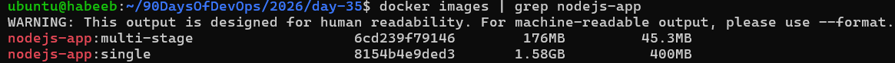

4. Why is the multi-stage image so much smaller?

Observation:

* Before, the `nodejs-app:single` image size was 1.58GB.

* After, `nodejs-app:multi-stage` build, it is reduced to 176MB, which is huge.

Why:

* The final image does not contain the builder image or unnecessary build tools.

* Copyies only essential runtime files, to keep it lightweight.
---

## Task 3: Push to Docker Hub
1. Create a free account on [Docker Hub](https://hub.docker.com) (if you don't have one)
2. Log in from your terminal
3. Tag your image properly: `yourusername/image-name:tag`
4. Push it to Docker Hub.

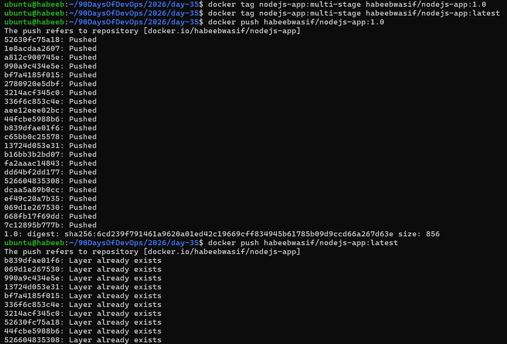

5. Pull it on a different machine (or after removing locally) to verify

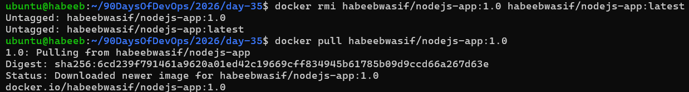

---

## Task 4: Docker Hub Repository
1. Go to Docker Hub and check your pushed image

[My-DockerHub-Link](https://hub.docker.com/repository/docker/habeebwasif/nodejs-app/general)

2. Add a **description** to the repository

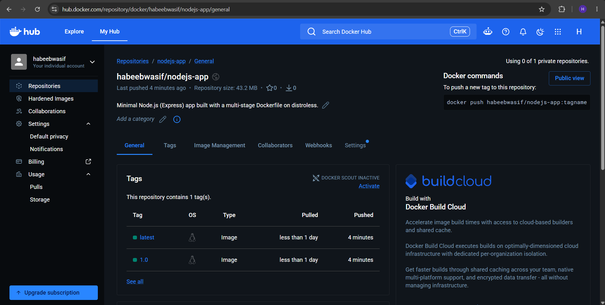

3. Explore the **tags** tab — understand how versioning works
4. Pull a specific tag vs `latest` — what happens?

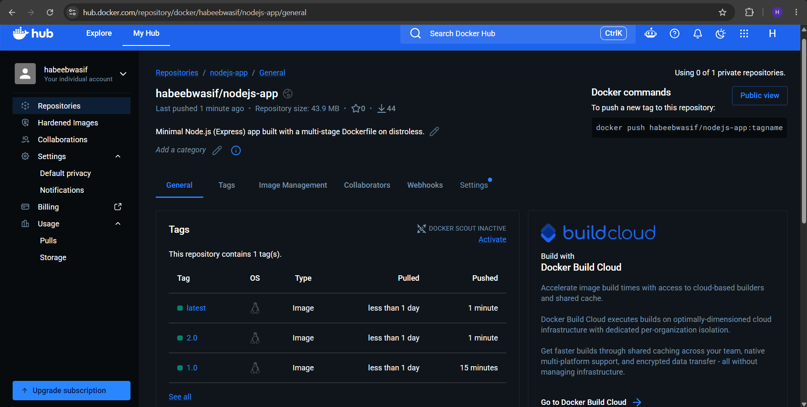

Observation:

* `Specific tag` pulls specific version whereas, `latest` pulls newest version.

---

## Task 5: Image Best Practices

(Bad practice)

[View my Dockerfile](react-app/Dockerfile)

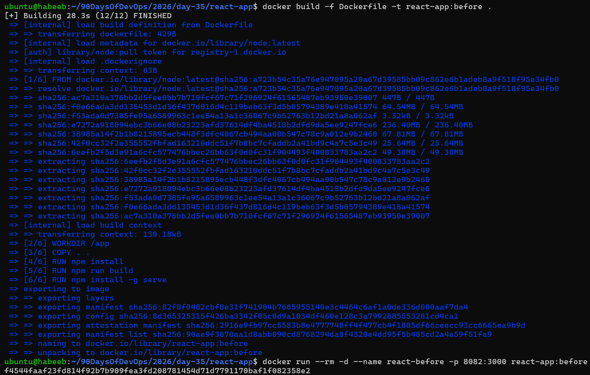

## BEST PRACTICE:

1. Use a **minimal base image** (alpine vs ubuntu — compare sizes)

[View my Minimal-Dockerfile](react-app/Dockerfile.multi)

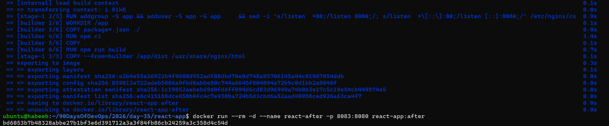

2. **Don't run as root** — add a non-root USER in your Dockerfile
3. Combine `RUN` commands to **reduce layers**
4. Use **specific tags** for base images (not `latest`)

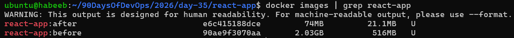

## Why use two stages?

The first stage is used for preparation:

```text
Node.js + Alpine + npm + dependencies
```

The second stage is used for running:

```text
Distroless Node.js + application files
```

The final image does not contain the builder image or unnecessary build tools.

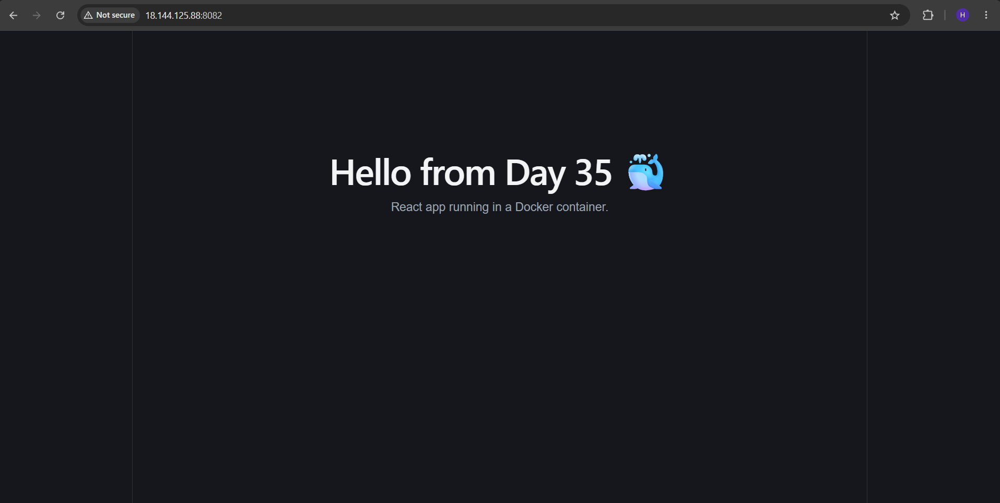

## How it meets the best practices

Practice | How this Dockerfile applies it |
---------| ------------------------------ |
Minimal image	| Uses Alpine for building and Distroless for running |
Smaller final image	| Copies only the application and production dependencies |
Production dependencies only |	Uses npm ci --omit=dev |
Specific tags	| Uses node:20-alpine and nodejs20-debian12 |
Non-root security |	Distroless Node images normally use a non-root default user |
Multi-stage build |	Separates preparation from runtime |


