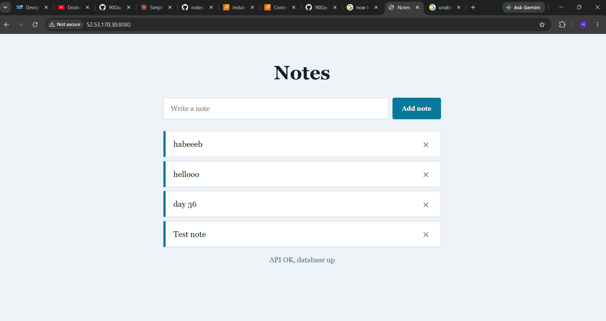
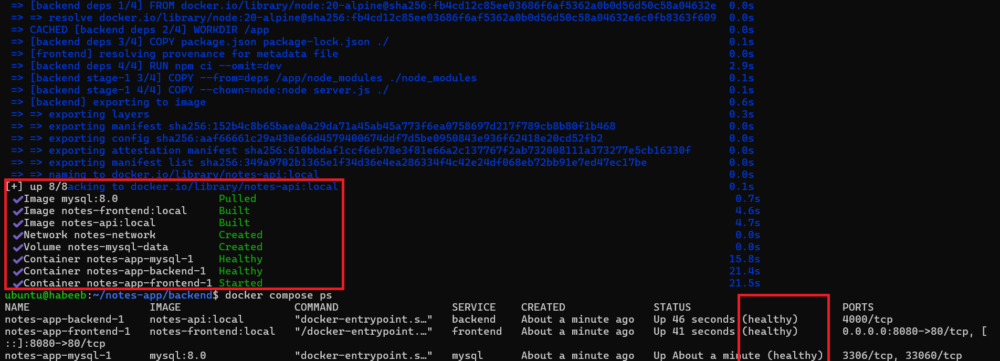
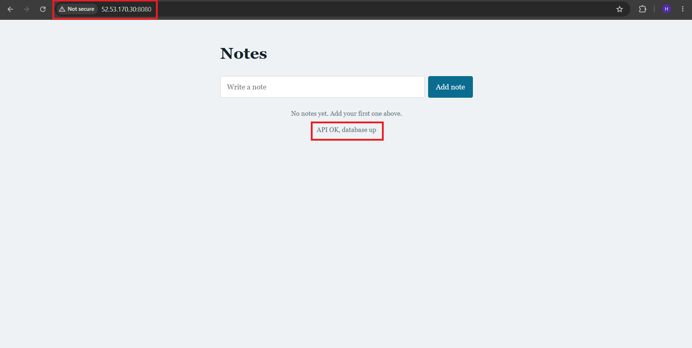
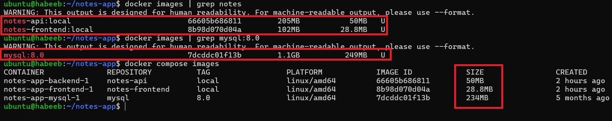
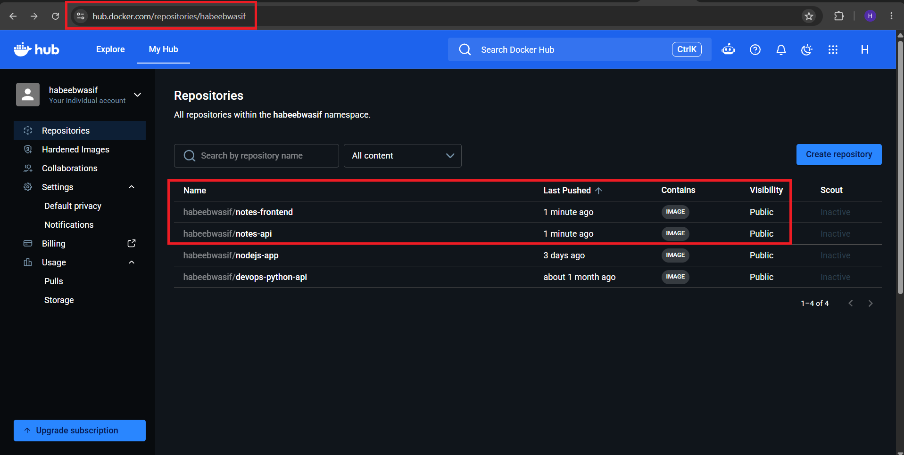
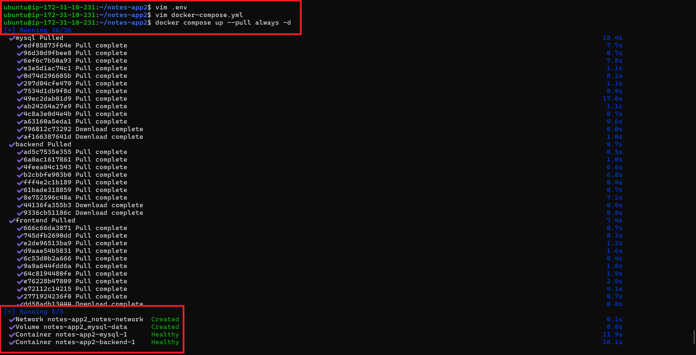

# Day 36 Docker Project

## 1. App choice and reason

[Project-Notes-App](https://github.com/Habeebwasif/notes-app)

I chose a notes application because it demonstrates a complete multi-container application flow:

- A static frontend served by Nginx.
- A Node.js and Express backend API.
- A MySQL database for persistent note storage.
- Nginx reverse-proxying `/api/` requests to the backend.
- Docker Compose coordinating the frontend, backend, and database.

The application allows users to view, add, and delete notes. The backend also provides a health endpoint that checks the database connection.



## 2. Application architecture

```text
Browser
  │
  │ http://localhost:8080
  ▼
Frontend container
Nginx serves index.html
  │
  │ /api/* and /health
  ▼
Backend container
Node.js and Express
  │
  ▼
MySQL container
Persistent Docker volume
```

The frontend uses relative API paths such as `/api/notes`. Nginx forwards those requests to `backend:4000` over the custom Compose network.

## 3. Backend Dockerfile

The backend Dockerfile uses a multi-stage build. The first stage installs production dependencies, and the final stage runs only the API source and production dependencies.

## 4. Frontend Dockerfile

The frontend image uses Nginx to serve the static page and proxy API requests.

## 5. Docker Compose startup

The final Compose file uses the public Docker Hub images instead of local build contexts.

Start the application on any machine with Docker and Compose installed:

```bash
docker compose up --pull always -d
```

Check the services:

```bash
docker compose ps
```



Open the UI:

```text
http://52.53.170.30:8080
```



## 6. Environment variables

Create `.env` beside `docker-compose.yml`:

```env
FRONTEND_PORT=8080
DB_HOST=mysql
DB_PORT=3306
DB_NAME=notesdb
DB_USER=notesuser
DB_PASSWORD=change-this-password
MYSQL_ROOT_PASSWORD=change-this-root-password
```

`DB_HOST` must be `mysql` because it is the Compose service name. Database credentials should be changed for deployment and must not be committed to source control.

## 7. Challenges and solutions

### Backend Dockerfile path

The backend files were moved into a `backend/` directory. Compose initially searched for `Dockerfile` in the project root and failed.

Solution: use the correct backend build context during the build phase, then use the published Docker Hub image for the final pull-only Compose file.

### Frontend-to-backend communication

The browser initially could not reach the API when frontend code used host-specific URLs such as `localhost`.

Solution: use relative browser requests:

```javascript
fetch('/api/notes')
```

Nginx forwards those requests internally:

```nginx
proxy_pass http://backend:4000;
```

### Port 80 conflict on EC2

Ubuntu Nginx was already using port 80 while the Docker frontend was published on port 8080.

Solution: access the application through port 8080 and allow TCP 8080 in the EC2 security group, or stop the host Nginx service and publish the container on port 80.

### Local image pull warnings

Compose tried to pull local-only names such as `notes-api:local` from Docker Hub.

Solution: tag and push the images with the Docker Hub namespace, then reference these public images in Compose:

```text
habeebwasif/notes-api:latest
habeebwasif/notes-frontend:latest
```

### Clean pull-only test

The application was tested after removing the application containers, local application images, MySQL image, volume, and network. Compose then pulled the images and started the stack without local Dockerfiles.

The final test verified:

- Frontend page returned HTTP 200.
- `/api/notes` returned HTTP 200.
- `/health` returned database status `up`.
- Creating a note returned HTTP 201.
- Deleting a note returned HTTP 204.
- All Compose services became healthy.

## 8. Final image sizes

Measured from the local Docker image listing:

| Image | Tag | Disk usage | Content size |
|---|---|---:|---:|
| Backend | `habeebwasif/notes-api:latest` | 205 MB | 50 MB |
| Frontend | `habeebwasif/notes-frontend:latest` | 93.6 MB | 26.3 MB |

The MySQL image is pulled separately from the official `mysql:8.0` image and is not part of the application images.



## 9. Docker Hub links

Backend image:

```text
https://hub.docker.com/r/habeebwasif/notes-api
```

Frontend image:

```text
https://hub.docker.com/r/habeebwasif/notes-frontend
```



## 10. Useful commands

Pull and start the published images:

```bash
docker compose up --pull always -d
```



View service status:

```bash
docker compose ps
```

View logs:

```bash
docker compose logs -f
```

Stop services while retaining the database volume:

```bash
docker compose down
```

Stop services and remove database data:

```bash
docker compose down -v
```
